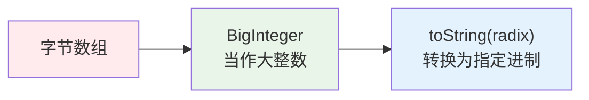
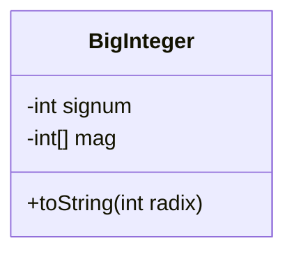
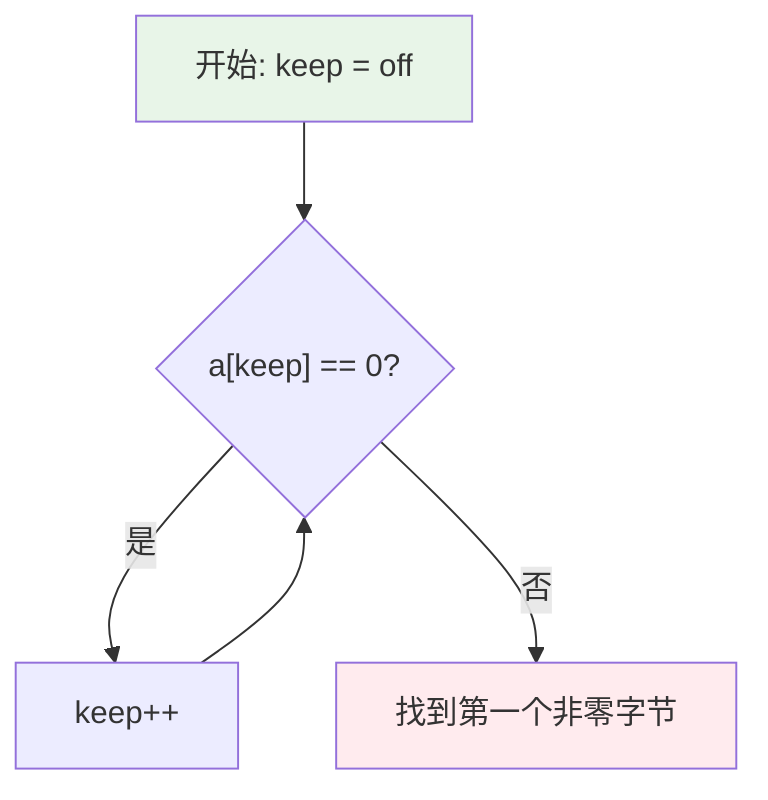
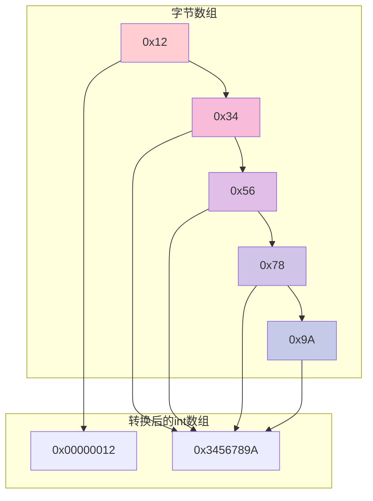
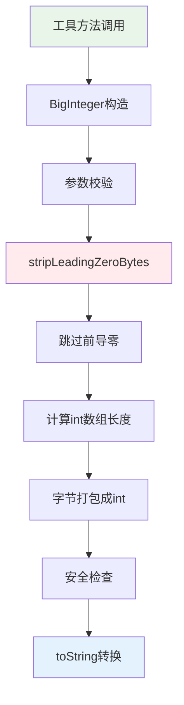
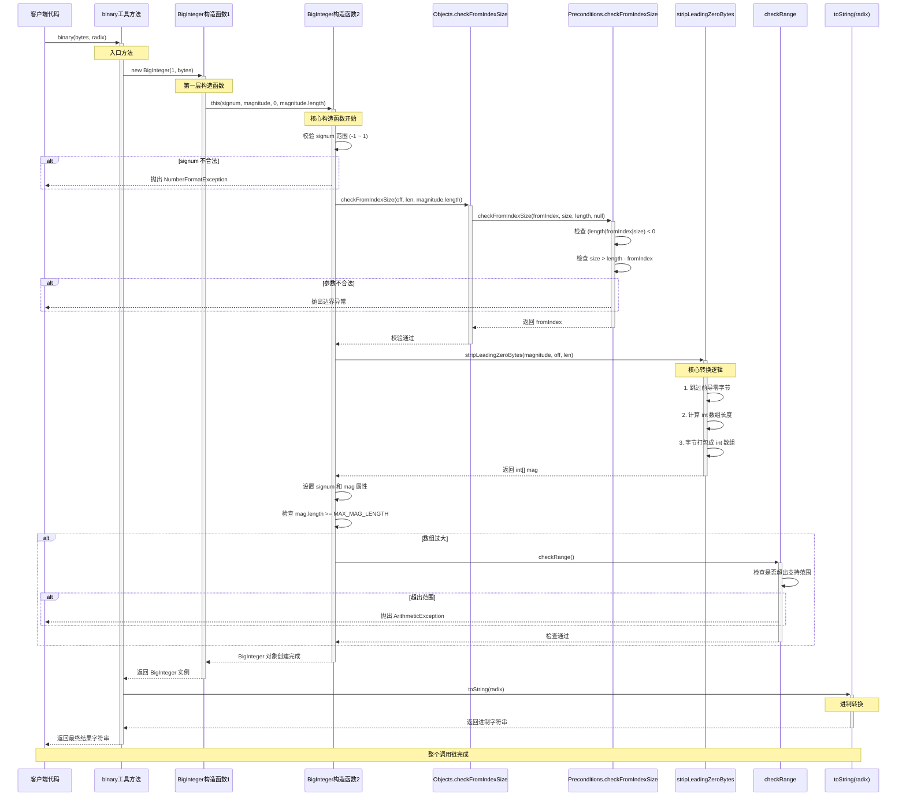

## 📋 目录

- [🎯 引言：从一个简单的工具方法开始](#引言)
- [🔧 工具方法分析](#工具方法分析)
- [🏗️ BigInteger构造函数解析](#biginteger构造函数解析)
- [🛡️ 参数校验机制](#参数校验机制)
- [⚡ 核心转换逻辑：stripLeadingZeroBytes](#核心转换逻辑)
- [🔒 安全检查机制](#安全检查机制)
- [💡 总结与思考](#总结与思考)

---

## 🎯 引言：从一个简单的方法开始

最近在写项目搜寻资料的途中看到了一个看似简单的方法：

```java
public static String binary(byte[] bytes, int radix){
    // 这里的1代表正数
    return new BigInteger(1, bytes).toString(radix);
}
```

这个方法的作用是将字节数组转换为指定进制的字符串。但是，**为什么需要BigInteger？这个`1`参数是什么意思？ 底层是如何实现的？**

带着这些疑问，我们一起跟进一下BigInteger的源码，看看它是如何实现的。

---

## 🔧 方法分析

### 🤔 为什么需要BigInteger？

首先，让我们理解为什么不能直接将字节数组转换为字符串，其实原因很简单：

<div style="background-color: #f8f9fa; border-left: 4px solid #007bff; padding: 15px; margin: 10px 0;">
<strong>🚫 问题：</strong> Java中并没有直接的"字节数组 → 指定进制字符串"的方法
</div>

```java
byte[] bytes = {15, 10, 205};
// bytes.toString() ❌ 只会得到类似 "[B@1a2b3c4d" 的内存地址
```

### 💡 BigInteger的作用

BigInteger在这里充当**"翻译器"**的角色：



### 🔢 参数解析

```java
new BigInteger(1, bytes)
```

- **`1`** (signum): <span style="color: red; font-weight: bold;">符号位</span>
  - `1` = 正数
  - `0` = 零
  - `-1` = 负数
- **`bytes`** (magnitude): 字节数组，表示数值的绝对值


### 🤔 那什么又是大整数呢？
在 Java 或其他语言中，整数类型都是有限大小的：
|类型| 大小 |范围 |
|--|--|--|
| byte | 1字节 | -128 ~ 127 |
| short | 2字节 | -32,768 ~ 32,767 |
| int | 4字节 | -2,147,483,648 ~ 2,147,483,647 |
| long | 8字节 | -9,223,372,036,854,775,808 ~ 9,223,372,036,854,775,807 |

如果你的数字超出这些范围，就需要“大整数”类型来表示，否则会溢出。

### Java中的大整数：`BigInteger`
为此Java 提供了 `java.math.BigInteger` 类，它的特点：
1. `任意大小`：理论上能存储无限大的整数（受内存限制）。
2. `不可变`：每次运算都会生成新对象。
3. `支持常用运算`：
```java
BigInteger a = new BigInteger("12345678901234567890");
BigInteger b = new BigInteger("98765432109876543210");
BigInteger sum = a.add(b); // 加法
BigInteger diff = b.subtract(a); // 减法
BigInteger mul = a.multiply(b); // 乘法
BigInteger div = b.divide(a);   // 除法
BigInteger mod = b.mod(a);      // 取模
```
### 为什么字节数组用大整数?
当我们把字节数组转换为整数时，数组长度可能远大于 8 个字节（long 的最大长度），比如：
```java
byte[] data = new byte[16]; // 16 字节 = 128 位

```
* long 只能表示`64 位`，存不下。
* 使用 BigInteger 可以安全地把任意长度字节数组当作一个整数，并做进制转换（十进制、八进制、十六进制）。

---
## 🏗️ BigInteger构造函数解析
### 第一层构造函数

```java
public BigInteger(int signum, byte[] magnitude) {
    this(signum, magnitude, 0, magnitude.length);
}
```

这是一个**委托构造函数**，将调用转发给更完整的构造函数：
- `off = 0`: 是offset偏移量的缩写，表示某个位置相对于某个起点的距离，这里是从数组开头开始
- `len = magnitude.length`: len在源码的注解是“the number of bytes to use.”意思是将要操作的字节数量，在这里我们要处理整个数组

### 第二层构造函数（核心实现）

```java
public BigInteger(int signum, byte[] magnitude, int off, int len) {
    // 1️⃣ 符号位校验，signum只允许-1，0，1三个值，如果不满足则会抛出异常
    if (signum < -1 || signum > 1) {
        throw(new NumberFormatException("Invalid signum value"));
    }

    // 2️⃣ 数组边界校验，检验从off位置起若要操作len个字节，那off+len应该小于字节数的长度
    Objects.checkFromIndexSize(off, len, magnitude.length);

    // 3️⃣ 核心转换：字节数组 → int数组
    this.mag = stripLeadingZeroBytes(magnitude, off, len);

    // 4️⃣ 符号位设置
    if (this.mag.length == 0) {
        this.signum = 0;
    } else {
        if (signum == 0)
            throw(new NumberFormatException("signum-magnitude mismatch"));
        this.signum = signum;
    }

    // 5️⃣ 溢出检查
    if (mag.length >= MAX_MAG_LENGTH) {
        checkRange();
    }
}
```

### 🏛️ BigInteger内部结构



---

## 🛡️ 参数校验机制

### Objects.checkFromIndexSize 方法链

```java
public static int checkFromIndexSize(int fromIndex, int size, int length) {
    return Preconditions.checkFromIndexSize(fromIndex, size, length, null);
}
```

```java
public static <X extends RuntimeException>
int checkFromIndexSize(int fromIndex, int size, int length,
                       BiFunction<String, List<Number>, X> oobef) {
    if ((length | fromIndex | size) < 0 || size > length - fromIndex)
        throw outOfBoundsCheckFromIndexSize(oobef, fromIndex, size, length);
    return fromIndex;
}
```

### 🔍 校验逻辑解析

<div style="background-color: #fff3cd; border: 1px solid #ffeaa7; border-radius: 5px; padding: 15px; margin: 10px 0;">
<strong>🧮 位运算技巧：</strong> <code>(length | fromIndex | size) < 0</code>
<br><br>
这个表达式巧妙地检查三个参数是否都为非负数：
<ul>
<li>如果任何一个参数为负数，按位或的结果必然为负</li>
<li>比分别检查每个参数更高效</li>
</ul>
</div>

**校验条件：**
1. 所有参数都必须非负
2. `size ≤ length - fromIndex`（不能越界）

---

## ⚡ 核心转换逻辑：stripLeadingZeroBytes

这是整个转换过程的**核心方法**，负责将字节数组转换为int数组。

### 🎯 方法概览

```java
// 三个参数分别为操作的字节数组a，偏移量off以及要操作的字节长度len
private static int[] stripLeadingZeroBytes(byte[] a, int off, int len) {
	// 定位要操作的最后一个字节的索引
    int indexBound = off + len;
    // 记录第一个不为零的索引
    int keep;

    // 🔍 步骤1: 跳过前导零，找到第一个不为零的索引
    for (keep = off; keep < indexBound && a[keep] == 0; keep++)
        ;

    // 📏 步骤2: 计算需要的int数组长度，+3保证向上取证，>>> 2相当于除以4
    int intLength = ((indexBound - keep) + 3) >>> 2;
    int[] result = new int[intLength];

    // 🔄 步骤3: 字节打包成int
    int b = indexBound - 1;
    for (int i = intLength-1; i >= 0; i--) {
        result[i] = a[b--] & 0xff;
        int bytesRemaining = b - keep + 1;
        int bytesToTransfer = Math.min(3, bytesRemaining);
        for (int j=8; j <= (bytesToTransfer << 3); j += 8)
            result[i] |= ((a[b--] & 0xff) << j);
    }
    return result;
}
```
相信看到这里肯定还是会很懵，不明白每一步具体是在做什么，别怕，接下来让我们深入讲解这个方法具体步骤。

### 📊 详细执行流程

#### 步骤1: 跳过前导零
**Q：** 为什么要找到第一个不为零的索引呢？

**A：** 为的就是配合**indexBound**(最后一个要操作的字节的索引)计算出要存储到BigInteger里的实际字节数是多少。

在前面我们知道BigInteger存储这些数是依赖于两个属性**signum(符号位)**和**mag(整型数组)**。我们都知道int类型会在内存中占用**4字节**也就是**32位**的空间。所以一个int类型可以存储**4个字节**，所以我们需要得到需要存储的总的字节数，然后除以4来得到我们一共需要多少个int空间来存储这些字节。但是由于java是**向零取整**，所以为了保证所有要存储的字节都能正确存储到mag数组中，需要 **+3来保证向上取证**。



#### 步骤2: 计算int数组长度

<div style="background-color: #e3f2fd; border-left: 4px solid #2196f3; padding: 15px; margin: 10px 0;">
<strong>🧮 长度计算公式：</strong>
<br><br>
<code>intLength = ((indexBound - keep) + 3) >>> 2</code>
<br><br>
<ul>
<li><code>indexBound - keep</code>: 有效字节数</li>
<li><code>+ 3</code>: 向上取整，确保所有有效字节都能正确存储到mag中</li>
<li><code>>>> 2</code>: 无符号右移两位，相当于整数除以4（一个int存4个字节）</li>
</ul>
</div>

#### 步骤3: 字节打包（核心算法）

让我们用具体例子来理解这个过程：

**输入示例：** `byte[] = {0x12, 0x34, 0x56, 0x78, 0x9A}`



**Q：** 看完这个流程图大家可能会有个疑问，那就是为什么BigInteger的源码里存储操作是倒着存的？
**A：** BigInteger 内部将字节数组倒着存储，是为了让低位在数组末尾，这样方便从低位开始做加减乘除等运算，符合数学计算的习惯（从个位开始进位），同时保持高位在前的大端逻辑
### 🔧 打包算法详解

**第1轮循环 (i = 1)：处理 `result[1]`**

```java
// 初始状态
int b = 4;  // 指向最后一个字节 0x9A
result[1] = 0;

// 1️⃣ 放入最低字节
result[1] = a[4] & 0xff;  // result[1] = 0x0000009A
b = 3;

// 2️⃣ 计算剩余字节
bytesRemaining = 3 - 0 + 1 = 4;
bytesToTransfer = Math.min(3, 4) = 3;

// 3️⃣ 依次左移打包
// j=8:  result[1] |= 0x78 << 8  = 0x0000789A
// j=16: result[1] |= 0x56 << 16 = 0x00567A9A
// j=24: result[1] |= 0x34 << 24 = 0x3456789A
```

**第2轮循环 (i = 0)：处理 `result[0]`**

```java
// b = 0, 指向 0x12
result[0] = a[0] & 0xff;  // result[0] = 0x00000012
// 没有剩余字节，循环结束
```

### 🎨 位运算可视化

<div style="background-color: #f5f5f5; border: 2px solid #ddd; border-radius: 8px; padding: 20px; font-family: monospace;">
<strong>一个int的32位结构：</strong>
<br><br>
<table style="border-collapse: collapse; width: 100%;">
<tr>
<td style="border: 2px solid #ff5722; padding: 8px; text-align: center; background-color: #ffebee;">[31-24位]<br/>第4字节</td>
<td style="border: 2px solid #ff9800; padding: 8px; text-align: center; background-color: #fff3e0;">[23-16位]<br/>第3字节</td>
<td style="border: 2px solid #ffc107; padding: 8px; text-align: center; background-color: #fffde7;">[15-8位]<br/>第2字节</td>
<td style="border: 2px solid #4caf50; padding: 8px; text-align: center; background-color: #e8f5e8;">[7-0位]<br/>第1字节</td>
</tr>
</table>
<br>
<strong>填充过程：</strong>
<br>
1. <code>result[i] = a[b--] & 0xff;</code> → 填充 [7-0位]
<br>
2. <code>result[i] |= (a[b--] & 0xff) << 8;</code> → 填充 [15-8位]
<br>
3. <code>result[i] |= (a[b--] & 0xff) << 16;</code> → 填充 [23-16位]
<br>
4. <code>result[i] |= (a[b--] & 0xff) << 24;</code> → 填充 [31-24位]
</div>

### 🔍 关键技术点解析

#### `& 0xff` 的作用

<div style="background-color: #ffebee; border-left: 4px solid #f44336; padding: 15px; margin: 10px 0;">
<strong>⚠️ 重要：</strong> 确保字节被当作无符号数处理
<br><br>
<code>
byte b = (byte)0xFF;  // 在Java中这是-1<br>
int i = b;            // 符号扩展为 0xFFFFFFFF (-1)<br>
int j = b & 0xff;     // 变成 0x000000FF (255) ✅
</code>
</div>

#### `|=` 按位或赋值运算符

```java
// |= 的作用：将多个字节组合到一个int中
result[i] = 0x0000009A;        // 初始值
result[i] |= 0x78 << 8;        // 0x0000009A | 0x00007800 = 0x0000789A
result[i] |= 0x56 << 16;       // 0x0000789A | 0x00560000 = 0x00567A9A
result[i] |= 0x34 << 24;       // 0x00567A9A | 0x34000000 = 0x3456789A
```

**为什么用 `|=` 而不是 `+=`？**
- **`|=`**: 按位或，不会影响已设置的位
- **`+=`**: 算术加法，可能产生进位，破坏字节边界

---

## 🔒 安全检查机制

### checkRange 方法

```java
private void checkRange() {
// private static final int MAX_MAG_LENGTH = Integer.MAX_VALUE / Integer.SIZE + 1;
    if (mag.length > MAX_MAG_LENGTH ||
        mag.length == MAX_MAG_LENGTH && mag[0] < 0) {
        reportOverflow();
    }
}

private static void reportOverflow() {
    throw new ArithmeticException("BigInteger would overflow supported range");
}
```

<div style="background-color: #fff3cd; border: 1px solid #ffeaa7; border-radius: 5px; padding: 15px; margin: 10px 0;">
<strong>🛡️ 安全边界：</strong>
<br><br>
BigInteger虽然理论上支持任意精度，但实际上有内存限制：
<ul>
<li>防止创建过大的数组导致内存溢出</li>
<li>确保系统稳定性</li>
</ul>
</div>

---

## 💡 总结与思考

### 🎯 核心流程总结



### 🧠 设计思想

1. **分层设计**: 从简单的工具方法到复杂的底层实现
2. **安全第一**: 多层参数校验和边界检查
3. **性能优化**: 位运算、批量处理等技巧
4. **可扩展性**: 支持任意精度的大整数运算

### 🔍 技术亮点

- **巧妙的位运算**: `(length | fromIndex | size) < 0` 一次性检查多个参数
- **高效的字节打包**: 4个字节打包成1个int，节省空间
- **大端序保持**: 确保数值语义正确
- **无符号处理**: `& 0xff` 避免符号扩展问题

### 🤔 深层思考

通过这次源码探索，我们看到了一个看似简单的方法背后的复杂实现。这提醒我们：

1. **不要小看任何"简单"的API**，其背后可能有精妙的设计
2. **源码就是学习途中最好的老师**，能让我们理解设计思想和实现细节
3. **基础知识很重要**，位运算、数据结构等都在实际应用中发挥作用

### 📚 完整调用链总结




让我们回顾整个调用链：

```java
// 1. 工具方法入口
public static String binary(byte[] bytes, int radix) {
    return new BigInteger(1, bytes).toString(radix);
}

// 2. 第一层构造函数
public BigInteger(int signum, byte[] magnitude) {
    this(signum, magnitude, 0, magnitude.length);
}

// 3. 核心构造函数
public BigInteger(int signum, byte[] magnitude, int off, int len) {
	// 判断signum参数合法性
	if (signum < -1 || signum > 1) {
            throw(new NumberFormatException("Invalid signum value"));
        }
	// 参数校验链
	Objects.checkFromIndexSize(off, len, magnitude.length);
    // 核心业务逻辑
    this.mag = stripLeadingZeroBytes(magnitude, off, len);
    // 安全边界检查
    if (this.mag.length == 0) {
            this.signum = 0;
        } else {
            if (signum == 0)
                throw(new NumberFormatException("signum-magnitude mismatch"));
            this.signum = signum;
        }
        if (mag.length >= MAX_MAG_LENGTH) {
            checkRange();
        }
}

// 4. 参数安全检验，判断参数是否非零且不越界
public static int checkFromIndexSize(int fromIndex, int size, int length) {
        return Preconditions.checkFromIndexSize(fromIndex, size, length, null);
    }
public static <X extends RuntimeException>
    int checkFromIndexSize(int fromIndex, int size, int length,
                           BiFunction<String, List<Number>, X> oobef) {
        if ((length | fromIndex | size) < 0 || size > length - fromIndex)
            throw outOfBoundsCheckFromIndexSize(oobef, fromIndex, size, length);
        return fromIndex;
    }

// 5. 字节转换核心
private static int[] stripLeadingZeroBytes(byte[] a, int off, int len) {
        int indexBound = off + len;
        int keep;
        // 跳过前导零
        for (keep = off; keep < indexBound && a[keep] == 0; keep++)
            ;
        // 计算数组长度
        int intLength = ((indexBound - keep) + 3) >>> 2;
        int[] result = new int[intLength];
        int b = indexBound - 1;
        // 核心打包字节数组逻辑
        for (int i = intLength-1; i >= 0; i--) {
            result[i] = a[b--] & 0xff;
            int bytesRemaining = b - keep + 1;
            int bytesToTransfer = Math.min(3, bytesRemaining);
            for (int j=8; j <= (bytesToTransfer << 3); j += 8)
                result[i] |= ((a[b--] & 0xff) << j);
        }
        return result;
    }
```

---

<div style="text-align: center; padding: 20px; background-color: #f8f9fa; border-radius: 8px; margin: 20px 0;">
<strong>🎉 探索完成！</strong>
<br><br>
从一个简单的 <code>new BigInteger(1, bytes).toString(radix)</code> 开始，
<br>
我们深入了解了Java大整数的底层存储字节数组的实现机制。下一期带大家探索一下BigInteger里的toString方法是如何做到将任意BigInteger按指定进制转换成对于的字符串的。
<br><br>
<em>源码面前，了无秘密！</em> 🔍✨
</div>

---
