> 📖 深入理解 MySQL InnoDB 存储引擎的核心组件 - Buffer Pool 的实现原理与优化机制


## 📋 目录

- [🎯 1. Buffer Pool 核心概念认知](#1-buffer-pool-核心概念认知)
- [⚙️ 2. Buffer Pool 内存大小配置策略](#2-buffer-pool-内存大小配置策略)
- [📦 3. 数据页在 Buffer Pool 中的存储机制](#3-数据页在-buffer-pool-中的存储机制)
- [🔗 4. 磁盘数据页与缓存页的映射关系](#4-磁盘数据页与缓存页的映射关系)
- [📝 5. 缓存页描述信息的元数据管理](#5-缓存页描述信息的元数据管理)
- [🚀 6. 数据库启动时的 Buffer Pool 初始化过程](#6-数据库启动时的-buffer-pool-初始化过程)
- [🔗 7. Free 链表：空闲缓存页管理机制](#7-free-链表空闲缓存页管理机制)
- [🗂️ 8. 数据页缓存哈希表：快速定位机制](#8-数据页缓存哈希表快速定位机制)
- [🧩 9. Buffer Pool 内存碎片问题与优化](#9-buffer-pool-内存碎片问题与优化)
- [💾 10. Flush 链表：脏页管理机制](#10-flush-链表脏页管理机制)
- [🔄 11. Buffer Pool 缓存页满载时的处理策略](#11-buffer-pool-缓存页满载时的处理策略)
- [⏳ 12. LRU 链表：最近最少使用算法实现](#12-lru-链表最近最少使用算法实现)
- [⚠️ 13. LRU 算法的性能瓶颈分析](#13-lru-算法的性能瓶颈分析)
- [🔥 14. LRU 优化：冷热数据分离策略](#14-lru-优化冷热数据分离策略)
- [⏰ 15. 后台定时刷新机制](#15-后台定时刷新机制)
- [📚 16. 技术总结与最佳实践](#16-技术总结与最佳实践)

---

## 🎯 1. Buffer Pool 核心概念认知

我们在对数据库执行增删改操作的时候，不可能直接更新磁盘上的数据，因为磁盘的随机IO性能相当差，随便一个大磁盘文件的随机IO操作，可能都要几百毫秒。如果直接操作磁盘，数据库每秒可能只能处理几百个请求。

实际上，当我们对数据库执行增删改操作时，主要都是针对内存里的 **Buffer Pool** 中的数据进行的，也就是对数据库内存中的数据结构进行增删改操作。

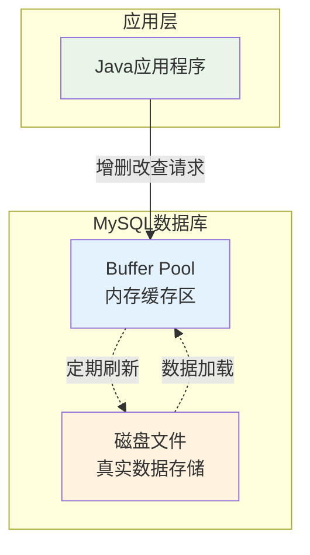

**Buffer Pool 总结**：
- Buffer Pool 是数据库的一个内存组件
- 里面缓存了磁盘上的真实数据
- 我们的增删改操作主要就是对这个内存数据结构中的缓存数据执行的
- 配合后续的 redo log、刷磁盘等机制保证数据持久性

## ⚙️ 2. Buffer Pool 内存大小配置策略

Buffer Pool 作为数据库的核心内存组件，其大小直接影响数据库的性能。因此，对其大小的合理配置至关重要。

**默认配置**：
- Buffer Pool 的默认大小为 **128MB**。对于现代服务器硬件而言，这个默认值通常过小，无法充分利用系统内存。
- 在生产环境中，强烈建议根据服务器的物理内存和业务负载对 Buffer Pool 进行调整，以达到最佳性能。

**配置示例**：
```ini
# 在 /etc/my.cnf 配置文件中设置
[server]
innodb_buffer_pool_size = 2147483648  # 示例：设置为 2GB
```

**💡 配置建议**：
- 一般建议将 `innodb_buffer_pool_size` 设置为物理内存的 **50% 到 75%**。例如，对于一台拥有 32GB 内存的服务器，可以将其配置为 16GB 到 24GB 之间。
- 必须为操作系统和其他进程预留足够的内存，避免因内存不足导致系统交换（swapping），从而严重影响性能。

## 📦 3. 数据页在 Buffer Pool 中的存储机制

MySQL InnoDB 将磁盘上的数据划分为若干个 **数据页（Data Page）**，每个数据页默认大小为 16KB，包含了多行记录。数据页是 InnoDB 管理磁盘数据的基本单位。

当需要对某行数据进行增删改查操作时，InnoDB 的处理流程如下：
1.  **定位数据页**：首先，InnoDB 会根据索引找到该行数据所在的数据页。
2.  **加载到 Buffer Pool**：如果该数据页尚未加载到 Buffer Pool 中，InnoDB 会将其从磁盘文件读取到 Buffer Pool 的一个空闲缓存页中。

**核心思想**：Buffer Pool 的基本存储单位是 **数据页**。所有的数据操作都以数据页为单位在内存中进行，从而避免了频繁的磁盘 I/O。

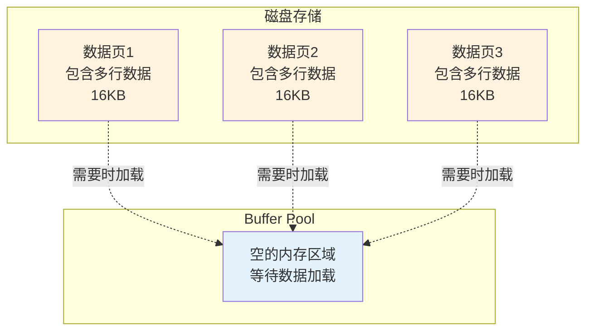

## 🔗 4. 磁盘数据页与缓存页的映射关系

**数据页与缓存页的一致性**：
- InnoDB 在磁盘上存储的数据页，其默认大小为 **16KB**。
- Buffer Pool 为了能够高效地缓存这些数据页，其内部的 **缓存页（Cache Page）** 大小与磁盘数据页的大小是 **严格一一对应的**，同样为 **16KB**。

**容量计算**：
- Buffer Pool 的总容量决定了它可以容纳多少个缓存页。例如，一个 128MB 的 Buffer Pool 可以容纳 `128MB / 16KB = 8192` 个缓存页。
- 这意味着，在任何时刻，Buffer Pool 都可以缓存 8192 个从磁盘加载的数据页。

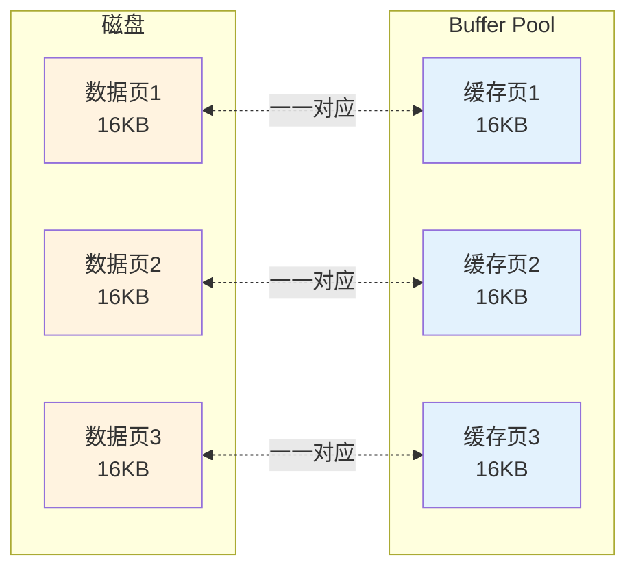

## 📝 5. 缓存页描述信息的元数据管理

为了有效管理 Buffer Pool 中的每一个缓存页，InnoDB 为每个缓存页都分配了一个 **描述信息块（Control Block）**。这个描述信息块独立于缓存页本身，用于存储该缓存页的元数据。

**核心元数据**：
- **表空间 ID (Space ID)** 和 **页号 (Page Number)**：唯一标识该缓存页对应的磁盘数据页。
- **链表指针**：包括 LRU 链表、Free 链表、Flush 链表等指针，用于在不同管理结构中定位该缓存页。
- **脏页标记 (Dirty Flag)**：标识该缓存页是否被修改过（即是否为脏页）。
- **哈希表指针**：用于在数据页缓存哈希表中进行链接。
- **其他状态信息**：如锁信息、LSN（Log Sequence Number）等。

**内存占用**：
- 每个描述信息块大约占用 **800字节**，约为缓存页大小（16KB）的 5%。
- 因此，Buffer Pool 实际占用的总内存会略大于 `innodb_buffer_pool_size` 的配置值，因为它还需要为这些描述信息块分配额外的内存空间。

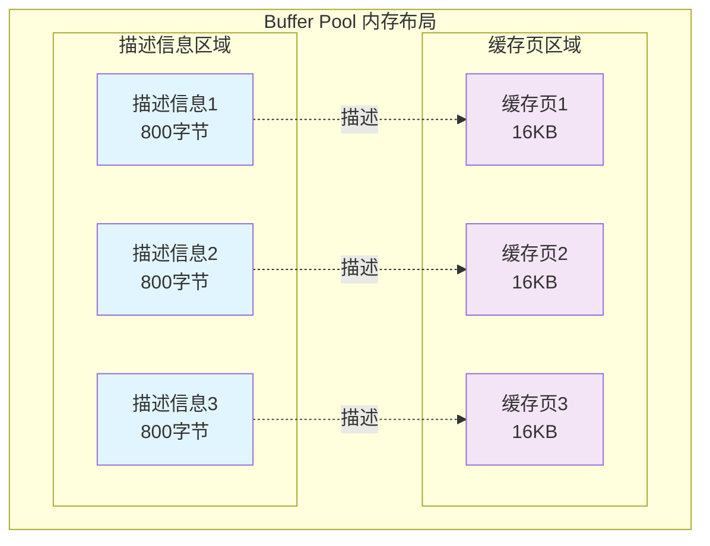

## 🚀 6. 数据库启动时的 Buffer Pool 初始化过程

在 MySQL 服务器启动时，InnoDB 会执行以下步骤来初始化 Buffer Pool：

1.  **内存申请**：InnoDB 根据 `innodb_buffer_pool_size` 的配置值，向操作系统申请一块连续的内存空间作为 Buffer Pool。
2.  **空间划分**：这块内存空间被划分为两大部分：
    *   **描述信息区**：用于存放所有缓存页的描述信息块（Control Blocks）。
    *   **缓存页区**：用于存放实际的数据页内容。
    InnoDB 会根据缓存页（16KB）和描述信息块（约800字节）的大小，精确地计算并划分出 N 个缓存页及其对应的描述信息块。
3.  **空闲链表初始化**：在初始化阶段，所有的缓存页都是空闲的。因此，InnoDB 会将所有缓存页的描述信息块都加入到 **Free 链表** 中，以便后续快速分配空闲缓存页。

**初始状态**：初始化完成后，Buffer Pool 处于“待命”状态。所有的缓存页都是空的，等待着数据库在处理用户请求时，从磁盘加载数据页来填充它们。


## 🔗 7. Free 链表：空闲缓存页管理机制

当 InnoDB 需要从磁盘加载一个新的数据页到 Buffer Pool 时，它必须能够快速找到一个可用的空闲缓存页。为了高效地管理这些空闲缓存页，InnoDB 引入了 **Free 链表**。

**Free 链表的核心作用**：
- **组织空闲缓存页**：Free 链表是一个双向链表，它将所有未被使用的缓存页的描述信息块串联起来，形成一个空闲缓存页的池子。
- **快速分配**：当需要分配一个空闲缓存页时，InnoDB 只需从 Free 链表的头部取下一个节点（即一个描述信息块），即可获得一个可用的缓存页，时间复杂度为 O(1)。

**工作机制**：
- **初始化**：在数据库启动时，所有的缓存页都是空闲的，因此它们的描述信息块都会被加入到 Free 链表中。
- **分配**：当一个数据页需要被加载时，InnoDB 从 Free 链表中取出一个描述信息块，将其对应的缓存页分配给该数据页，并将该描述信息块从 Free 链表中移除。
- **释放**：当一个缓存页被淘汰后，其描述信息块会重新被加入到 Free 链表的头部，以备后续使用。


**如何将磁盘页读取到 Buffer Pool 的缓存页中**：
1. 从 free 链表里获取一个描述数据块
2. 找到这个描述数据块对应的空闲缓存页
3. 把磁盘上的数据页读到该缓存页中
4. 把相关描述数据写到描述数据块中
5. 将该描述数据块从 free 链表中移除

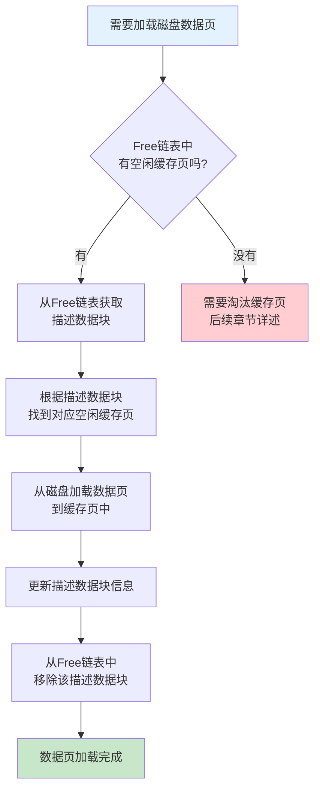

## 🗂️ 8. 数据页缓存哈希表：快速定位机制

有了 Free 链表，我们解决了如何快速找到空闲缓存页的问题。但随之而来的是另一个关键问题：**当需要访问一个数据页时，如何快速判断它是否已经被缓存在 Buffer Pool 中了呢？**

如果每次都去遍历 Buffer Pool 中的所有缓存页，效率将极其低下。为了解决这个问题，InnoDB 设计了一个 **数据页缓存哈希表**。

**哈希表的核心作用**：
- **快速定位**：通过哈希表，InnoDB 可以以 O(1) 的时间复杂度快速定位一个数据页是否已经被缓存，以及它在 Buffer Pool 中的具体位置。

**工作机制**：
- **Key-Value 结构**：
    - **Key**：由 **表空间号 (Space ID)** 和 **数据页号 (Page Number)** 组合而成，这个组合是数据页在磁盘上的唯一标识。
    - **Value**：指向该数据页对应缓存页的描述信息块的指针。
- **查询流程**：
    1.  当需要访问一个数据页时，InnoDB 会使用其 “表空间号 + 数据页号” 作为 Key 在哈希表中进行查找。
    2.  如果 **查找成功**，则直接通过 Value 指针访问对应的缓存页，实现缓存命中。
    3.  如果 **查找失败**，则说明该数据页尚未被缓存。此时，InnoDB 会从 Free 链表中获取一个空闲缓存页，从磁盘加载数据页，然后将新的 Key-Value 对存入哈希表中。

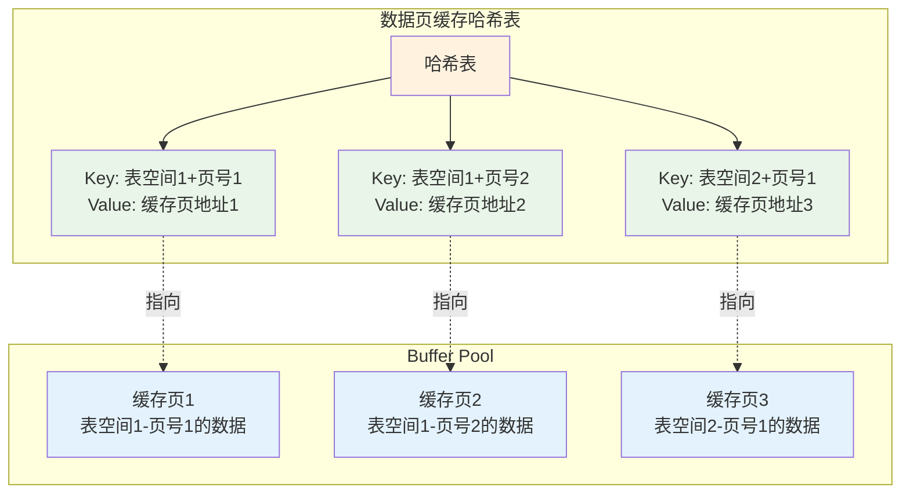

现在我们的 Buffer Pool 结构更完整了：

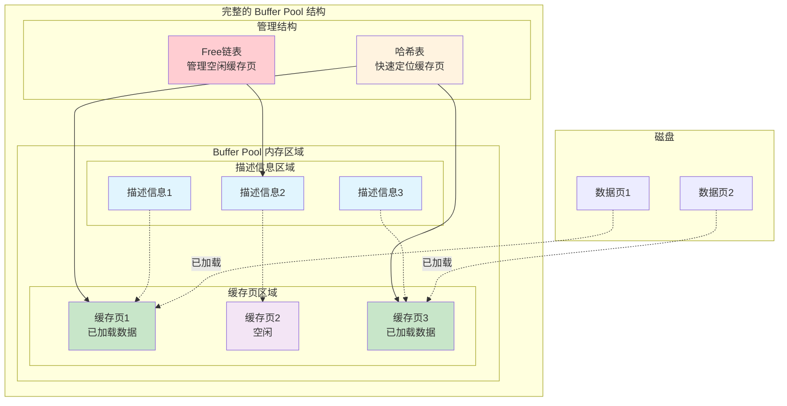

## 🧩 9. Buffer Pool 内存碎片问题与优化

**Buffer Pool 是否存在内存碎片问题？**

严格来说，由于 InnoDB 采用固定大小的缓存页（16KB）进行内存管理，它 **几乎不会产生传统意义上的内存碎片**。所有的内存都被划分为大小均等的块，分配和回收都以页为单位，因此不会出现因大小不一的内存块频繁申请和释放而导致的碎片。

然而，在 **初始化阶段** 可能会产生一种极小的“内存碎片”：
-   当 InnoDB 申请 `innodb_buffer_pool_size` 大小的内存后，会将其划分为 N 个“缓存页 + 描述信息块”的组合。
-   如果用户设置的 `innob_buffer_pool_size` 不能被“缓存页 + 描述信息块”的大小整除，那么在划分完 N 个组合后，可能会 **剩余一小块无法利用的内存**。这部分内存因为太小，无法容纳一个完整的缓存页，因此在 Buffer Pool 的生命周期内都无法被使用。

**如何避免内存碎片？**

-   **内部对齐**：InnoDB 内部在计算和分配时，会自动进行内存对齐，尽可能减少这种剩余空间。
-   **合理配置**：虽然用户无需精确计算，但理解其内存划分机制有助于我们认识到，这种“碎片”是初始化时一次性产生的，对后续运行性能没有影响。因此，我们只需要关注为 Buffer Pool 分配合理的总大小即可。

## 💾 10. Flush 链表：脏页管理机制

**什么是脏页（Dirty Page）？**

当 Buffer Pool 中的一个缓存页被修改后（例如，执行了 INSERT, UPDATE, DELETE 操作），其内容就与磁盘上的数据页不再一致。这个被修改过的缓存页就被称为 **脏页（Dirty Page）**。

**为什么需要管理脏页？**

- **持久化**：内存中的修改必须最终被写回磁盘，以保证数据的持久性。
- **性能优化**：数据库刷盘时，只需要将脏页写回磁盘即可。那些只被读取而未被修改的“干净页”则无需刷盘，这大大减少了不必要的磁盘 I/O，提升了性能。

**Flush 链表：脏页的“花名册”**

为了高效地管理和定位所有的脏页，InnoDB 引入了 **Flush 链表**。

- **工作机制**：Flush 链表是一个双向链表，专门用于串联所有脏页的描述信息块。
- **加入链表**：当一个缓存页首次被修改时，它的描述信息块就会被加入到 Flush 链表中。
- **移除链表**：当这个脏页被成功刷新回磁盘后，其内容就与磁盘一致，变回“干净页”，此时它的描述信息块就会从 Flush 链表中移除。

通过 Flush 链表，InnoDB 可以轻松地找到所有需要持久化的脏页，而无需遍历整个 Buffer Pool。

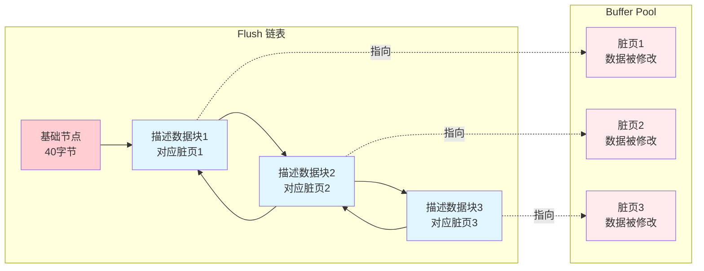

现在的 Buffer Pool 结构更加完善了：

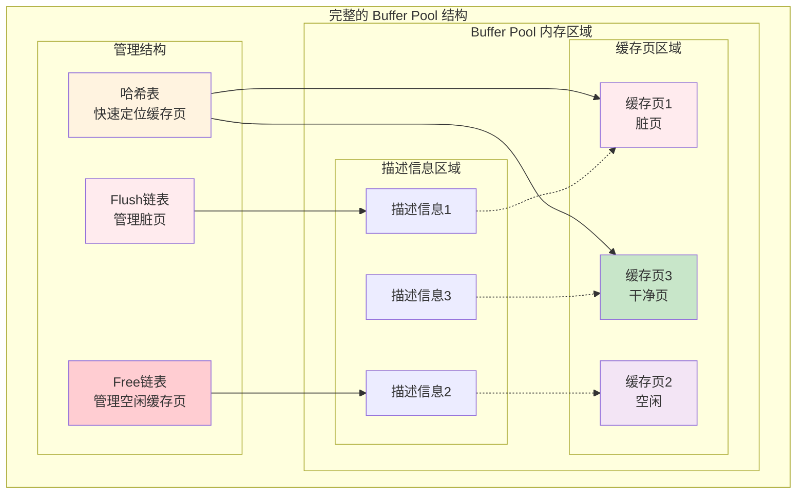

## 🔄 11. Buffer Pool 缓存页满载时的处理策略

当 Buffer Pool 中所有的缓存页都被使用，并且 Free 链表为空时，如果此时需要加载一个新的数据页，InnoDB 就必须 **淘汰（Evict）** 一个现有的缓存页来腾出空间。

**页面淘汰机制**：
页面淘汰是一个“腾笼换鸟”的过程：
1.  **选择牺牲品**：根据某种策略（后续将介绍的 LRU 算法）选择一个最适合被淘汰的缓存页。
2.  **脏页刷盘**：如果被选中的缓存页是一个脏页，那么必须先将其内容刷新回磁盘，以保证数据不丢失。
3.  **释放空间**：刷盘完成后（或者如果它本身就是干净页），该缓存页就可以被清空，其描述信息块被重新加入到 Free 链表的头部。
4.  **加载新页**：最后，将新的数据页从磁盘加载到这个刚刚被释放的缓存页中。

**核心目标：提升缓存命中率**
页面淘汰策略的优劣直接决定了 **缓存命中率（Buffer Pool Hit Rate）**。一个优秀的淘汰算法应该能够：
-   **淘汰冷数据**：尽可能淘汰那些未来最不可能被访问的“冷”数据页。
-   **保留热数据**：尽可能保留那些被频繁访问的“热”数据页。

为了实现这一目标，InnoDB 引入了经典的 LRU 算法。

## ⏳ 12. LRU 链表：最近最少使用算法实现

为了精准地识别出 Buffer Pool 中的“热”数据和“冷”数据，InnoDB 采用了经典的 **LRU（Least Recently Used，最近最少使用）** 算法，并通过 **LRU 链表** 这一数据结构来实现。

**LRU 算法的核心思想**：
“如果一个数据在最近被访问过，那么它在将来被访问的概率也很高。”

**经典 LRU 链表的工作原理**：
1.  **访问即置顶**：当一个数据页被访问时（无论是从磁盘新加载还是已在缓存中被访问），它的描述信息块都会被移动到 LRU 链表的 **头部**。
2.  **尾部即淘汰**：LRU 链表的 **尾部** 存放的是最长时间未被访问的数据页。
3.  **淘汰策略**：当需要淘汰页面时，InnoDB 会直接选择 LRU 链表尾部的页面作为“牺牲品”。

通过这种机制，LRU 链表就像一个动态的“排行榜”，头部是近期最活跃的数据，而尾部则是最“沉寂”的数据，这为页面淘汰提供了简单而有效的决策依据。

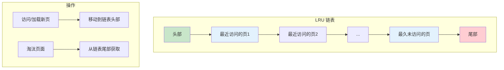

现在，我们的 Buffer Pool 最终结构图也完整了：

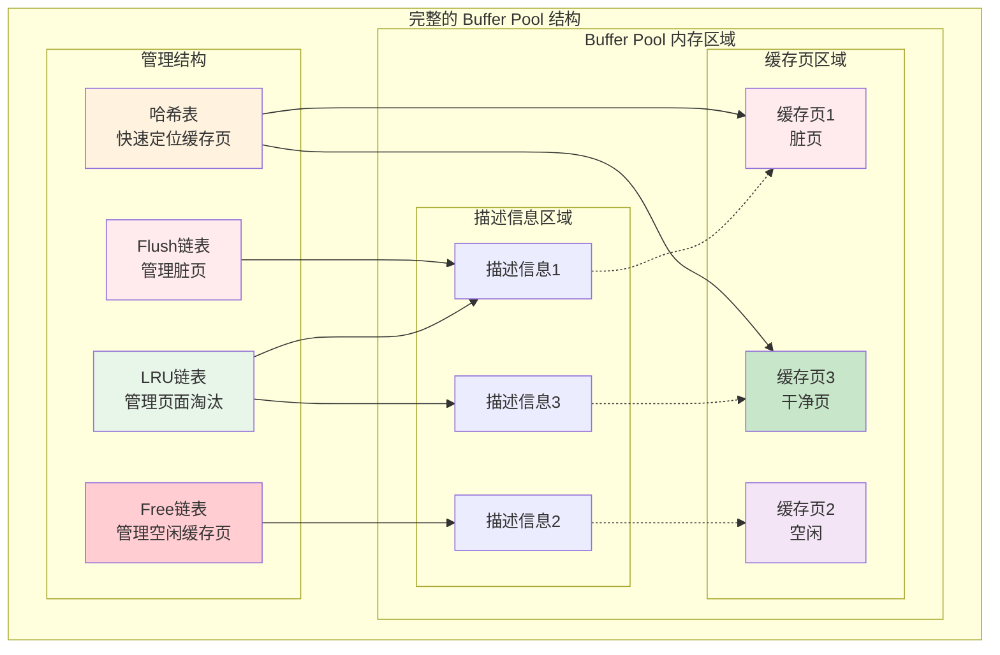

## ⚠️ 13. LRU 算法的性能瓶颈分析

经典的 LRU 算法虽然简单有效，但在数据库的实际应用场景中，会面临两大严峻挑战，可能导致缓存效率急剧下降。这两个“罪魁祸首”就是 **预读（Read-Ahead）机制** 和 **全表扫描（Full Table Scan）**。

### 问题一：MySQL 的预读机制

**预读机制**：为了提升 I/O 效率，InnoDB 在加载一个数据页时，会“智能”地预测你可能很快会访问到相邻的数据页，因此会提前将这些相邻的数据页也一并加载到 Buffer Pool 中。这是一种空间换时间的优化策略。

**对 LRU 的冲击**：
- **污染 LRU 头部**：预读进来的数据页，和用户真正请求的数据页一样，都会被放置在 LRU 链表的头部。
- **“劣币驱逐良币”**：如果预读进来的数据页实际上并未被访问（即“预读失败”），它们就会成为“冷”数据，却占据了 LRU 链表的头部“热”数据区域。
- **热点数据被挤出**：当大量预读失败的页面涌入 LRU 头部时，会迅速将原本真正被频繁访问的“热”数据页从链表头部挤向尾部，最终导致这些宝贵的热点数据被过早地淘汰出 Buffer Pool。

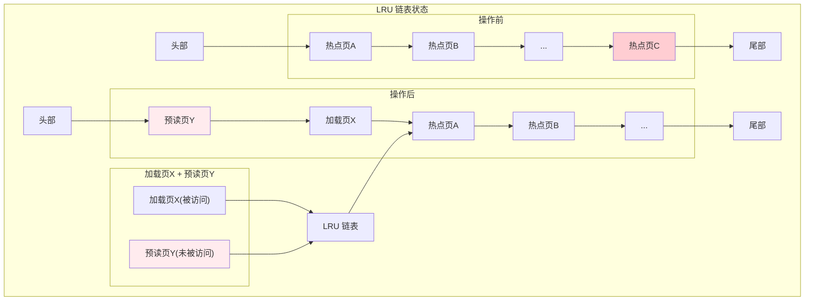

### 问题二：全表扫描

### 问题二：全表扫描

另一个对 LRU 算法造成毁灭性打击的场景，就是 **全表扫描**。例如，执行一条未加 `WHERE` 条件的 `SELECT` 语句：

```sql
SELECT * FROM users;
```

**对 LRU 的冲击**：
- **“缓存大换血”**：执行全表扫描时，InnoDB 会将 `users` 表的所有数据页依次从磁盘加载到 Buffer Pool 中。如果表非常大，这可能会在短时间内将 Buffer Pool 中的原有缓存页全部替换掉。
- **热点数据被“洗劫”**：这些为了一次性查询而加载进来的数据，会瞬间占领 LRU 链表的头部，将之前积累的热点数据全部挤到链表尾部。
- **缓存效率雪崩**：全表扫描结束后，Buffer Pool 中充满了大量可能再也不会被访问的“冷”数据。而当系统需要淘汰页面时，那些刚刚被挤到队尾的、真正的热点数据，反而成了最先被淘汰的“牺牲品”，导致数据库性能急剧下降。

## 🔥 14. LRU 优化：冷热数据分离策略

为了完美解决经典 LRU 算法的性能瓶颈，InnoDB 实现了一种更为精妙的 **冷热数据分离** 优化策略。

**核心思想**：
InnoDB 将整个 LRU 链表划分为两个区域：
-   **热数据区 (Young Area)**：靠近链表头部，存放那些被频繁访问的、真正的热点数据。
-   **冷数据区 (Old Area)**：靠近链表尾部，存放新加载的数据页以及访问频率较低的数据。

**区域分割点**：
-   这两个区域的比例由 `innodb_old_blocks_pct` 参数控制，默认值为 **37**。这意味着，冷数据区默认约占整个 LRU 链表的 **37%**，而热数据区则占据剩余的 **63%**。

这种设计从根本上隔离了潜在的“缓存污染源”。

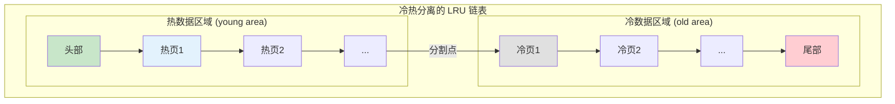

**页面流转与晋升机制**：
1.  **新页入冷宫**：所有新加载的数据页（无论是用户请求还是预读），其描述信息块都会被放置在 **冷数据区的头部**。这相当于一个“观察期”，避免了新数据直接污染热数据区。
2.  **“冷宫”晋升考验**：
    *   当一个位于冷数据区的页面被访问时，它并不会立刻被移动到热数据区。
    *   InnoDB 会启动一个计时器。只有当该页面在 **首次加载后的特定时间窗口内**（由 `innodb_old_blocks_time` 参数控制，默认 1000ms）被再次访问，它才有资格“晋升”到 **热数据区的头部**。
3.  **热区保鲜**：当一个已经位于热数据区的页面被访问时，它会被移动到热数据区的头部，以保持其“热度”。
4.  **淘汰策略**：当需要淘汰页面时，InnoDB 会从 **冷数据区的尾部** 开始淘汰，这里存放的是最长时间未被访问，且未能通过“晋升考验”的页面。

**💡 这种设计的精妙之处**：
-   **有效防御缓存污染**：对于全表扫描或预读加载进来的大量数据，它们只会在加载时被访问一次。由于无法在 `innodb_old_blocks_time` 时间窗口内被再次访问，它们永远不会进入热数据区，只会在冷数据区短暂停留后被淘汰，从而完美地保护了热点数据。
-   **精准识别热点**：只有那些真正被反复访问的数据，才能通过时间的考验，从冷数据区晋升到热数据区，成为受保护的热点数据。

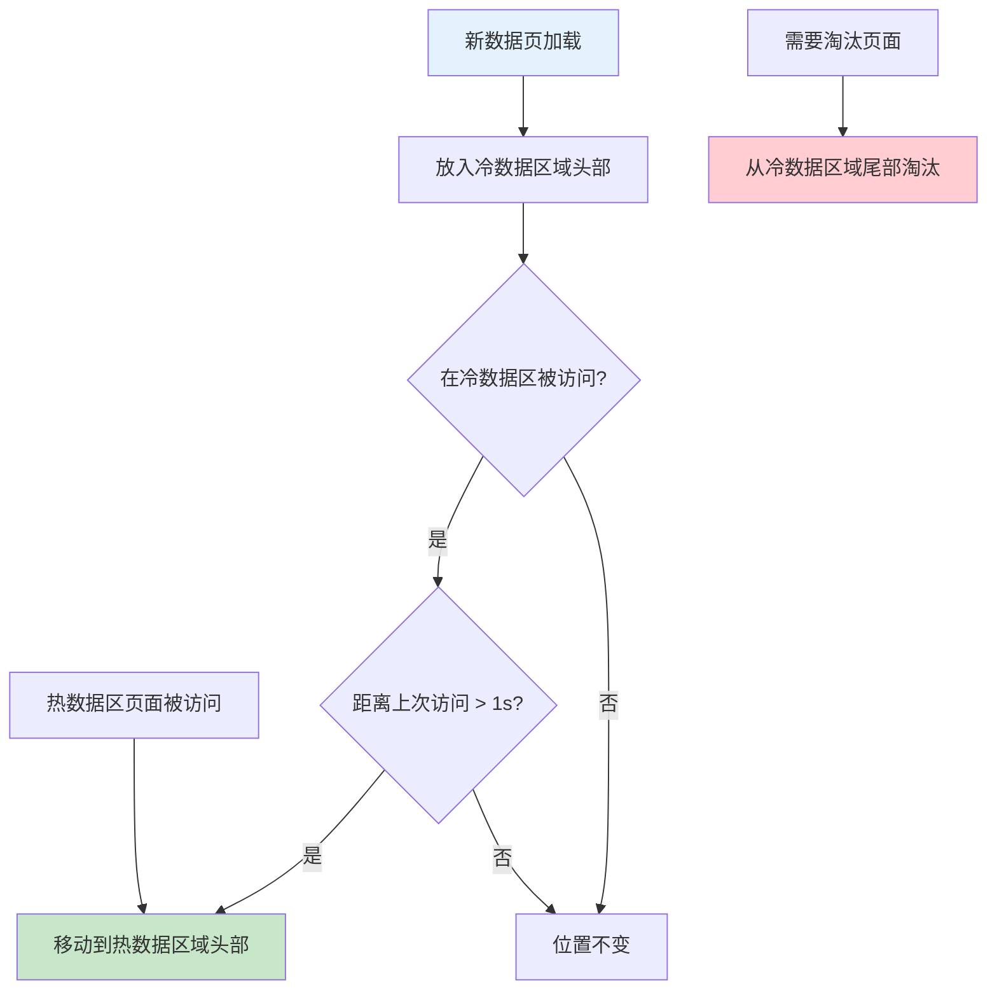

## ⏰ 15. 后台定时刷新机制

为了确保内存中的修改能够及时、平稳地持久化到磁盘，MySQL 并不会等到 Buffer Pool 被占满才开始刷盘。相反，它依赖于一个强大的 **后台线程** 系统来主动、持续地执行刷盘操作。

**核心后台线程**：
-   **Master Thread**: 这是 InnoDB 的主后台线程，它会以较高的频率（通常是每秒或每十秒）执行多种后台任务，其中就包括将脏页从 Buffer Pool 刷新到磁盘。
-   **Page Cleaner Threads**: 从 MySQL 5.6 开始引入，专门负责脏页的刷新工作，将刷盘任务从 Master Thread 中分离出来，以提升系统的并发性能。

**刷盘策略**：
后台线程并非盲目地刷盘，而是遵循一定的策略：
1.  **LRU 链表冷数据区刷盘**：后台线程会定期扫描 LRU 链表的冷数据区尾部，将这些“最冷”的页面（如果是脏页）刷新到磁盘，然后释放它们，并将其描述信息块加入 Free 链表。这是一种 **主动回收空闲空间** 的策略，确保 Free 链表中始终有可用的缓存页。
2.  **Flush 链表刷盘**：后台线程也会定期扫描 Flush 链表，将一部分脏页刷新回磁盘。这种策略旨在 **控制脏页的比例**，防止系统中积累过多的脏页，从而平滑 I/O 压力，避免在系统繁忙时出现突发的大量刷盘操作。

> **🤔 思考：断电与数据安全**
> 既然刷盘是后台异步执行的，那么如果脏页还没来得及刷回磁盘，MySQL 就突然宕机或断电了，内存中的修改数据岂不是就丢失了？
> 这个问题引出了 MySQL 的另一个核心机制——**Redo Log**。我们将在后续的日志篇章中详细探讨 InnoDB 如何通过 Redo Log 来保证即使在宕机情况下也能恢复数据，实现事务的持久性。
## 📚 16. 技术总结与最佳实践

MySQL InnoDB 的 Buffer Pool 是一个设计精巧、高度优化的内存缓存系统，它是支撑 InnoDB 高性能读写的核心。其内部通过多种数据结构协同工作，实现对数据页高效、智能的管理。

**数据页生命周期全览**：
1.  **查找**：当需要访问数据时，InnoDB 使用 `表空间号 + 数据页号` 作为 Key，在 **哈希表** 中快速查找。
2.  **命中**：若在哈希表中找到，则直接访问 Buffer Pool 中的缓存页。
3.  **未命中**：
    *   从 **Free 链表** 获取一个空闲缓存页。
    *   从磁盘加载数据页到该缓存页。
    *   在哈希表中注册该页。
    *   将该页的描述信息块放入 **LRU 链表的冷数据区头部**。
4.  **访问与晋升**：
    *   访问冷数据区的页面，若满足时间窗口条件，则 **晋升** 到 LRU 链表的热数据区头部。
    *   访问热数据区的页面，则 **移动** 到热数据区头部，保持其热度。
5.  **修改与持久化**：
    *   当缓存页被修改，成为 **脏页**，其描述信息块被加入 **Flush 链表**。
    *   后台线程会根据 **LRU 链表** 和 **Flush 链表** 的状态，智能地将脏页刷新回磁盘。
6.  **淘汰**：当需要释放空间时，从 **LRU 链表的冷数据区尾部** 选择页面进行淘汰。

**💡 最佳实践建议**：
-   **合理配置大小**：将 `innodb_buffer_pool_size` 设置为物理内存的 50%-75% 是一个很好的起点，确保为操作系统和其他进程留有足够内存。
-   **监控命中率**：通过 `SHOW ENGINE INNODB STATUS` 命令持续关注 Buffer Pool 的命中率。一个健康的系统，其命中率应稳定在 99% 以上。
-   **避免全表扫描**：优化 SQL 查询，为 `WHERE` 和 `JOIN` 子句中的列创建合适的索引，是减少缓存污染、提升 Buffer Pool 效率的根本手段。
-   **理解预读**：虽然预读通常有益，但在某些特定场景下也可能导致性能问题。了解 `innodb_read_ahead_threshold` 等参数，有助于在极端情况下进行微调。