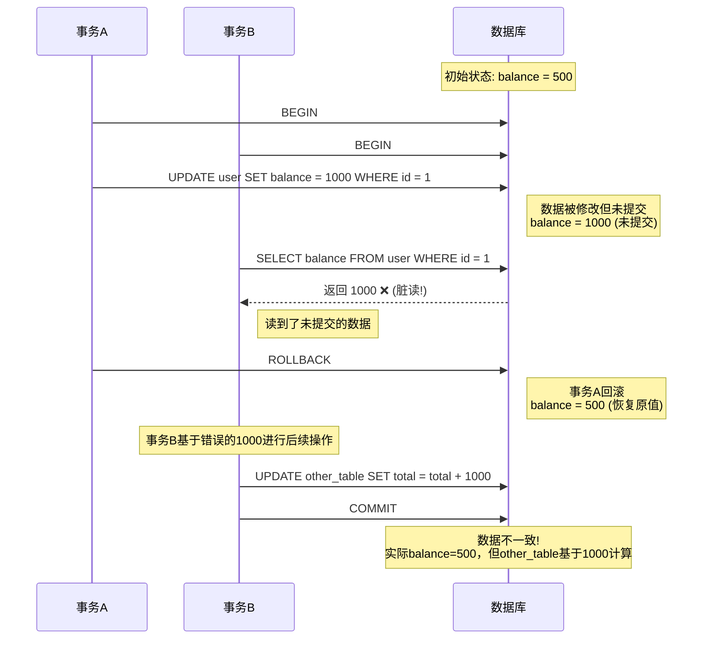
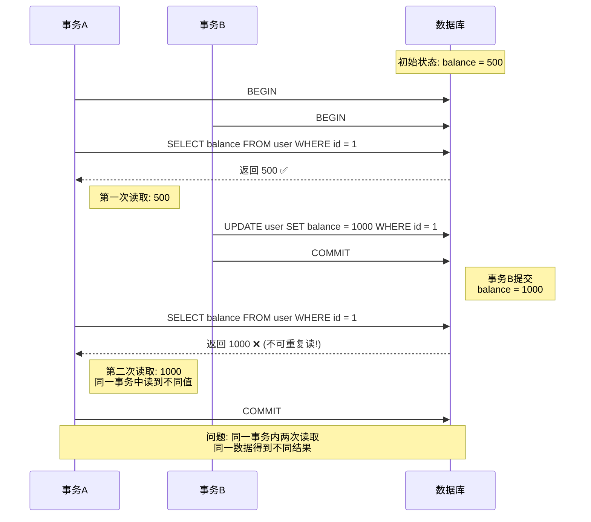
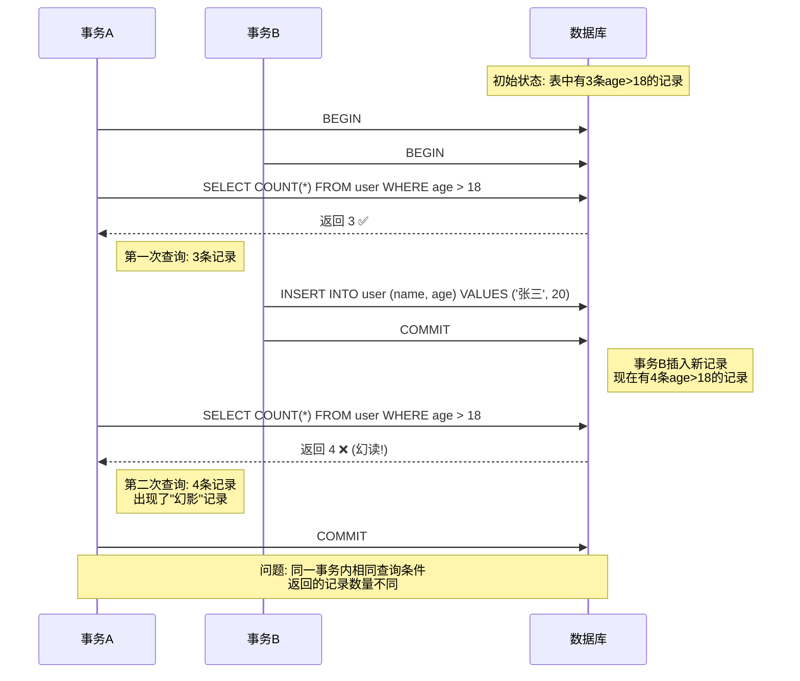
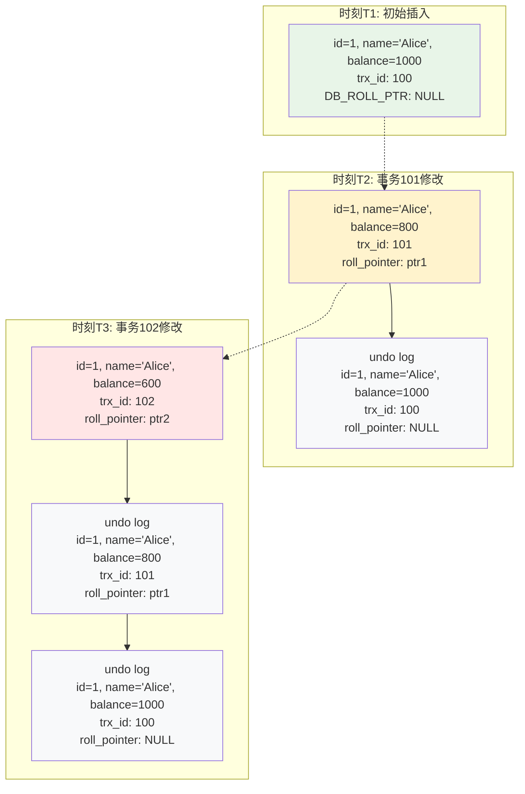
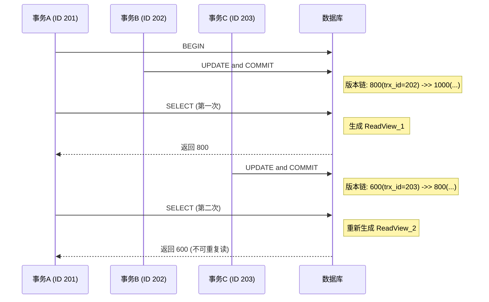
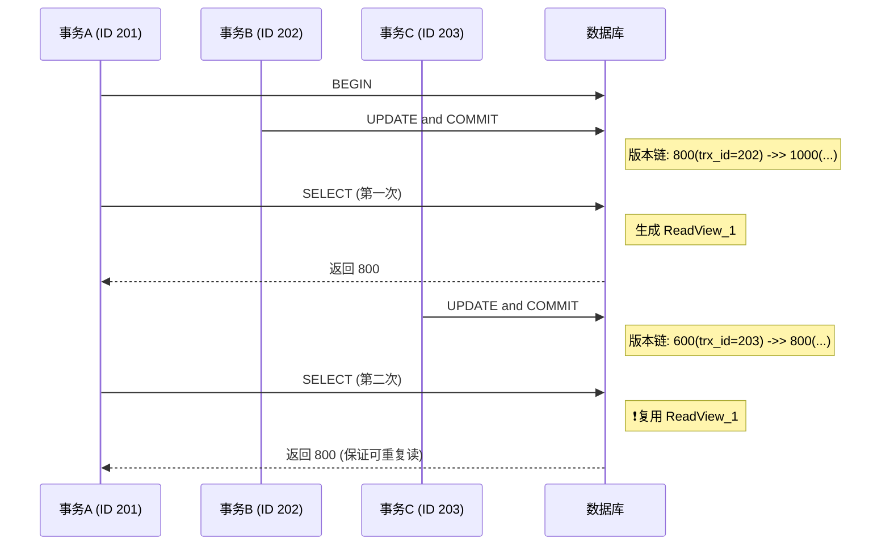
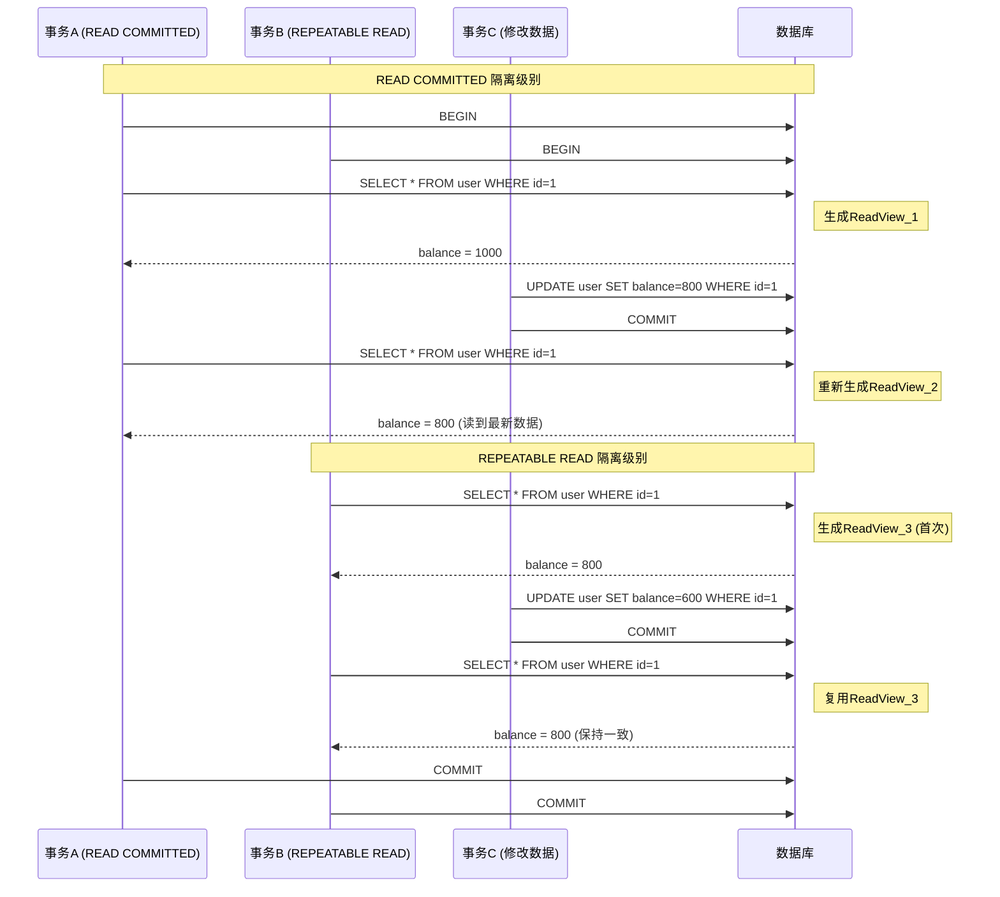

## 📋 目录

- [1. 引言](#1-引言)
- [2. 事务基础](#2-事务基础)
  - [2.1 什么是事务](#21-什么是事务)
  - [2.2 ACID特性](#22-acid特性)
- [3. 事务并发问题](#3-事务并发问题)
  - [3.1 脏读 (Dirty Read)](#31-脏读-dirty-read)
  - [3.2 不可重复读 (Non-Repeatable Read)](#32-不可重复读-non-repeatable-read)
  - [3.3 幻读 (Phantom Read)](#33-幻读-phantom-read)
- [4. 事务隔离级别](#4-事务隔离级别)
  - [4.1 四种隔离级别](#41-四种隔离级别)
  - [4.2 隔离级别与并发问题的关系](#42-隔离级别与并发问题的关系)
- [5. MVCC概述](#5-mvcc概述)
  - [5.1 什么是MVCC](#51-什么是mvcc)
  - [5.2 MVCC的优势](#52-mvcc的优势)
- [6. MVCC实现原理](#6-mvcc实现原理)
  - [6.1 版本链 (Version Chain)](#61-版本链-version-chain)
  - [6.2 ReadView机制](#62-readview机制)
  - [6.3 可见性判断算法](#63-可见性判断算法)
- [7. MVCC在不同隔离级别下的表现](#7-mvcc在不同隔离级别下的表现)
  - [7.1 场景分析：READ COMMITTED (读已提交)](#71-场景分析read-committed-读已提交)
  - [7.2 场景分析：REPEATABLE READ (可重复读)](#72-场景分析repeatable-read-可重复读)
- [8. MVCC的局限性与优化](#8-mvcc的局限性与优化)
  - [8.1 MVCC的代价：局限性分析](#81-mvcc的代价局限性分析)
  - [8.2 性能保障：MVCC的优化机制](#82-性能保障mvcc的优化机制)
- [9. 深度解析：MySQL如何解决幻读](#9-深度解析mysql如何解决幻读)
  - [9.1 快照读场景：MVCC如何避免幻读](#91-快照读场景mvcc如何避免幻读)
  - [9.2 当前读场景：Next-Key Lock如何锁定幻读](#92-当前读场景next-key-lock如何锁定幻读)
  - [9.3 混合模式：MVCC与锁的协同工作](#93-混合模式mvcc与锁的协同工作)
---

## 1. 引言

在现代数据库系统中，**并发控制**是确保数据一致性和系统性能的关键技术。随着多用户、高并发应用的普及，如何在保证数据正确性的同时最大化系统吞吐量成为了一个重要挑战。

<div style="background-color: #f0f8ff; padding: 15px; border-left: 4px solid #4a90e2; margin: 10px 0;">
<strong>💡 思考：</strong> 为什么需要并发控制？<br>
想象一个银行系统，如果两个用户同时对同一账户进行转账操作，没有适当的控制机制，可能导致数据不一致，造成资金损失。
</div>

**MVCC (Multi-Version Concurrency Control)** 作为一种先进的并发控制技术，通过维护数据的多个版本来解决并发访问问题，在MySQL、PostgreSQL等主流数据库中得到广泛应用。

---
> 在正式讲解mvcc之前我们需要先进行数据库相关知识点的回顾
## 2. 事务基础

### 2.1 什么是事务

**事务**是数据库操作的基本单位，它将一组相关的数据库操作组合成一个不可分割的工作单元。

```sql
-- 经典的银行转账事务示例
BEGIN TRANSACTION;
UPDATE accounts SET balance = balance - 100 WHERE account_id = 'A001';
UPDATE accounts SET balance = balance + 100 WHERE account_id = 'A002';
COMMIT;
```

<details>
<summary><strong>🔍 点击展开：事务的生命周期</strong></summary>

1. **开始** (BEGIN)：标记事务的开始
2. **执行** (EXECUTE)：执行一系列数据库操作
3. **提交** (COMMIT)：永久保存所有更改
4. **回滚** (ROLLBACK)：撤销所有更改（发生错误时）

</details>

### 2.2 ACID特性

事务必须满足ACID四个特性：

<table style="width: 100%; border-collapse: collapse; margin: 20px 0;">
<thead>
<tr style="background-color: #f5f5f5;">
<th style="border: 1px solid #ddd; padding: 12px; text-align: left;">特性</th>
<th style="border: 1px solid #ddd; padding: 12px; text-align: left;">英文</th>
<th style="border: 1px solid #ddd; padding: 12px; text-align: left;">含义</th>
<th style="border: 1px solid #ddd; padding: 12px; text-align: left;">示例</th>
</tr>
</thead>
<tbody>
<tr>
<td style="border: 1px solid #ddd; padding: 12px;"><strong>原子性</strong></td>
<td style="border: 1px solid #ddd; padding: 12px;">Atomicity</td>
<td style="border: 1px solid #ddd; padding: 12px;">事务中的操作要么全部成功，要么全部失败</td>
<td style="border: 1px solid #ddd; padding: 12px;">转账操作中，扣款和加款必须同时成功</td>
</tr>
<tr style="background-color: #f9f9f9;">
<td style="border: 1px solid #ddd; padding: 12px;"><strong>一致性</strong></td>
<td style="border: 1px solid #ddd; padding: 12px;">Consistency</td>
<td style="border: 1px solid #ddd; padding: 12px;">事务执行前后，数据库保持一致状态</td>
<td style="border: 1px solid #ddd; padding: 12px;">转账前后，总金额保持不变</td>
</tr>
<tr>
<td style="border: 1px solid #ddd; padding: 12px;"><strong>隔离性</strong></td>
<td style="border: 1px solid #ddd; padding: 12px;">Isolation</td>
<td style="border: 1px solid #ddd; padding: 12px;">并发执行的事务之间相互隔离</td>
<td style="border: 1px solid #ddd; padding: 12px;">一个事务的中间状态对其他事务不可见</td>
</tr>
<tr style="background-color: #f9f9f9;">
<td style="border: 1px solid #ddd; padding: 12px;"><strong>持久性</strong></td>
<td style="border: 1px solid #ddd; padding: 12px;">Durability</td>
<td style="border: 1px solid #ddd; padding: 12px;">事务提交后，更改永久保存</td>
<td style="border: 1px solid #ddd; padding: 12px;">即使系统崩溃，已提交的数据也不会丢失</td>
</tr>
</tbody>
</table>

---

## 3. 事务并发问题

当多个事务并发执行时，如果没有适当的控制机制，会产生以下问题：

### 3.1 脏读 (Dirty Read)

**定义**：如果一个事务读取到了另一个未提交事务修改过的数据，我们就称发生了脏读现象。

<div style="background-color: #fff5f5; padding: 15px; border-left: 4px solid #e74c3c; margin: 10px 0;">
<strong>⚠️ 问题场景：</strong><br>
事务A修改了数据但未提交，事务B读取了这个未提交的数据。如果事务A回滚，事务B读到的就是"脏数据"。
</div>

<div align="center">



</div>

### 3.2 不可重复读 (Non-Repeatable Read)

**定义**：同一事务内，多次读取同一数据得到不同结果。



<div style="background-color: #fff8e1; padding: 15px; border-left: 4px solid #ff9800; margin: 10px 0;">
<strong>🤔 分析：</strong><br>
同一个事务中，两次读取同一行数据得到了不同的结果。这在某些业务场景下是不可接受的，比如生成报表时需要数据的一致性。
</div>

### 3.3 幻读 (Phantom Read)

**定义**：如果一个事务先根据某些搜索条件查询出一些记录，在该事务未提交时，另一个事务写入了一些符合第一个事务搜索条件的记录（如insert、delete、update），就意味着发生了幻读。。

<div style="background-color: #f3e5f5; padding: 15px; border-left: 4px solid #9c27b0; margin: 10px 0;">
<strong>👻 幻读特点：</strong><br>
• 主要影响范围查询 (WHERE条件)<br>
• 新增或删除记录导致结果集变化<br>
• 与不可重复读的区别：幻读关注记录数量，不可重复读关注记录内容
</div>

<div align="center">


</div>

---

## 4. 事务隔离级别

为了解决上述并发问题，SQL标准定义了四种事务隔离级别：

### 4.1 四种隔离级别
1.  **读未提交(READ UNCOMMITTED)**：读未提交隔离级别，只限制了两个数据不能同时修改，但是修改数据的时候，即使事务未提交，都是可以被别的事务读取到的，这级别的事务隔离有脏读、重复读、幻读的问题；
2. **读已提交(READ COMMITTED)**：读已提交隔离级别，当前事务只能读取到其他事务提交的数据，所以这种事务的隔离级别解决了脏读问题，但还是会存在重复读、幻读问题
3. **可重复读(REPEATABLE READ)**：可重复读隔离级别，限制了读取数据的时候，不可以进行修改，所以解决了重复读的问题，但是读取范围数据的时候，是可以插入数据，所以还会存在幻读问题；
4. **串行化(SERIALIZABLE)**：事务最高的隔离级别，在该级别下，所有事务都是进行串行化顺序执行的。可以避免脏读、不可重复读与幻读所有并发问题。但是这种事务隔离级别下，事务执行很耗性能。

<table style="width: 100%; border-collapse: collapse; margin: 20px 0;">
<thead>
<tr style="background-color: #e8f4fd;">
<th style="border: 1px solid #ddd; padding: 12px; text-align: center;">隔离级别</th>
<th style="border: 1px solid #ddd; padding: 12px; text-align: center;">脏读</th>
<th style="border: 1px solid #ddd; padding: 12px; text-align: center;">不可重复读</th>
<th style="border: 1px solid #ddd; padding: 12px; text-align: center;">幻读</th>
<th style="border: 1px solid #ddd; padding: 12px; text-align: center;">并发性能</th>
</tr>
</thead>
<tbody>
<tr>
<td style="border: 1px solid #ddd; padding: 12px;"><strong>READ UNCOMMITTED</strong><br><small>读未提交</small></td>
<td style="border: 1px solid #ddd; padding: 12px; text-align: center; color: #e74c3c;">❌ 可能</td>
<td style="border: 1px solid #ddd; padding: 12px; text-align: center; color: #e74c3c;">❌ 可能</td>
<td style="border: 1px solid #ddd; padding: 12px; text-align: center; color: #e74c3c;">❌ 可能</td>
<td style="border: 1px solid #ddd; padding: 12px; text-align: center; color: #27ae60;">🚀 最高</td>
</tr>
<tr style="background-color: #f9f9f9;">
<td style="border: 1px solid #ddd; padding: 12px;"><strong>READ COMMITTED</strong><br><small>读已提交</small></td>
<td style="border: 1px solid #ddd; padding: 12px; text-align: center; color: #27ae60;">✅ 避免</td>
<td style="border: 1px solid #ddd; padding: 12px; text-align: center; color: #e74c3c;">❌ 可能</td>
<td style="border: 1px solid #ddd; padding: 12px; text-align: center; color: #e74c3c;">❌ 可能</td>
<td style="border: 1px solid #ddd; padding: 12px; text-align: center; color: #f39c12;">⚡⚡ 较高</td>
</tr>
<tr>
<td style="border: 1px solid #ddd; padding: 12px;"><strong>REPEATABLE READ</strong><br><small>可重复读</small></td>
<td style="border: 1px solid #ddd; padding: 12px; text-align: center; color: #27ae60;">✅ 避免</td>
<td style="border: 1px solid #ddd; padding: 12px; text-align: center; color: #27ae60;">✅ 避免</td>
<td style="border: 1px solid #ddd; padding: 12px; text-align: center; color: #e74c3c;">❌ 可能</td>
<td style="border: 1px solid #ddd; padding: 12px; text-align: center; color: #f39c12;">⚡ 中等</td>
</tr>
<tr style="background-color: #f9f9f9;">
<td style="border: 1px solid #ddd; padding: 12px;"><strong>SERIALIZABLE</strong><br><small>串行化</small></td>
<td style="border: 1px solid #ddd; padding: 12px; text-align: center; color: #27ae60;">✅ 避免</td>
<td style="border: 1px solid #ddd; padding: 12px; text-align: center; color: #27ae60;">✅ 避免</td>
<td style="border: 1px solid #ddd; padding: 12px; text-align: center; color: #27ae60;">✅ 避免</td>
<td style="border: 1px solid #ddd; padding: 12px; text-align: center; color: #e74c3c;">🐌 最低</td>
</tr>
</tbody>
</table>

### 4.2 隔离级别与并发问题的关系

<div style="background-color: #e8f5e8; padding: 15px; border-left: 4px solid #4caf50; margin: 10px 0;">
<strong>💡 关键洞察：</strong><br>
隔离级别越高，数据一致性越好，但并发性能越差。这是一个经典的<strong>一致性与性能的权衡</strong>。
</div>

```sql
-- 设置隔离级别示例 (MySQL)
SET SESSION TRANSACTION ISOLATION LEVEL READ COMMITTED;
SET SESSION TRANSACTION ISOLATION LEVEL REPEATABLE READ;
```

### 4.3 数据库是如何保证事务的隔离性的呢？
数据库是通过**加锁**，来实现事务的隔离性的。这就好像，如果你想一个人静静，不被别人打扰，你就可以在房门上加上一把锁。

加锁确实好使，可以保证隔离性。比如串行化隔离级别就是加锁实现的。但是频繁的加锁，导致读数据时，没办法修改，修改数据时，没办法读取，大大降低了数据库性能。

那么，如何解决加锁后的性能问题的？

答案就是,MVCC多版本并发控制！它实现读取数据不用加锁，可以让读取数据同时修改。修改数据时同时可读取。读写彻底不矛盾！

---

## 5. MVCC概述

### 5.1 什么是MVCC

**MVCC (Multi-Version Concurrency Control)** 是一种并发控制方法，通过维护数据的多个版本来实现事务的隔离性。
>通俗地讲，数据库中同时存在多个版本的数据，并不是整个数据库的多个版本，而是某一条记录的多个版本同时存在，在某个事务对其进行操作的时候，需要查看这一条记录的隐藏列事务版本id，比对事务id并根据事物隔离级别去判断读取哪个版本的数据。

<div style="background-color: #f0f8ff; padding: 20px; border: 2px solid #4a90e2; border-radius: 8px; margin: 15px 0;">
<h4 style="color: #4a90e2; margin-top: 0;">🎯 MVCC核心思想</h4>
<ul>
<li><strong>读不阻塞写</strong>：读操作不会阻塞写操作</li>
<li><strong>写不阻塞读</strong>：写操作不会阻塞读操作</li>
<li><strong>版本管理</strong>：为每个数据行维护多个版本</li>
<li><strong>时间戳机制</strong>：通过事务ID确定数据可见性</li>
</ul>
</div>

数据库隔离级别中的**读已提交**、**可重复读**都是基于`MVCC`实现的，相对于加锁简单粗暴的方式，它用更好的方式去处理读写冲突，能有效提高数据库并发性能。

### 5.2 MVCC的优势

相比传统的锁机制，MVCC具有以下优势：

<table style="width: 100%; border-collapse: collapse; margin: 20px 0;">
<thead>
<tr style="background-color: #f5f5f5;">
<th style="border: 1px solid #ddd; padding: 12px;">对比维度</th>
<th style="border: 1px solid #ddd; padding: 12px;">传统锁机制</th>
<th style="border: 1px solid #ddd; padding: 12px;">MVCC机制</th>
</tr>
</thead>
<tbody>
<tr>
<td style="border: 1px solid #ddd; padding: 12px;"><strong>读写冲突</strong></td>
<td style="border: 1px solid #ddd; padding: 12px;">读写互斥，性能较差</td>
<td style="border: 1px solid #ddd; padding: 12px; color: #27ae60;">读写不冲突，性能优秀</td>
</tr>
<tr style="background-color: #f9f9f9;">
<td style="border: 1px solid #ddd; padding: 12px;"><strong>并发度</strong></td>
<td style="border: 1px solid #ddd; padding: 12px;">并发度受限</td>
<td style="border: 1px solid #ddd; padding: 12px; color: #27ae60;">高并发支持</td>
</tr>
<tr>
<td style="border: 1px solid #ddd; padding: 12px;"><strong>死锁风险</strong></td>
<td style="border: 1px solid #ddd; padding: 12px;">存在死锁风险</td>
<td style="border: 1px solid #ddd; padding: 12px; color: #27ae60;">大大降低死锁概率</td>
</tr>
<tr style="background-color: #f9f9f9;">
<td style="border: 1px solid #ddd; padding: 12px;"><strong>存储开销</strong></td>
<td style="border: 1px solid #ddd; padding: 12px;">存储开销小</td>
<td style="border: 1px solid #ddd; padding: 12px; color: #e74c3c;">需要额外存储版本信息</td>
</tr>
</tbody>
</table>

---

## 6. MVCC实现原理

MVCC的实现涉及多个核心组件的协同工作，让我们深入了解其内部机制。

### 6.1 事务版本号
> 事务每次开启前，都会从数据库获得一个自增长的事务ID，可以从事务ID判断事务的执行先后顺序。这就是事务版本号。

### 6.2 版本链 (Version Chain)

每当一行数据被修改时，InnoDB不会直接覆盖原数据，而是创建一个新版本，形成**版本链**。

#### 6.2.1 行记录结构

对于InnoDB存储引擎，每一行记录都有两个隐藏列trx_id、roll_pointer，如果表中没有主键和非NULL唯一键时，则还会有第三个隐藏的主键列row_id。

<table style="width: 100%; border-collapse: collapse; margin: 20px 0;">
<thead>
<tr style="background-color: #f0f8ff;">
<th style="border: 1px solid #ddd; padding: 12px;">字段名</th>
<th style="border: 1px solid #ddd; padding: 12px;">大小</th>
<th style="border: 1px solid #ddd; padding: 12px;">作用</th>
</tr>
</thead>
<tbody>
<tr>
<td style="border: 1px solid #ddd; padding: 12px;"><code>trx_id</code></td>
<td style="border: 1px solid #ddd; padding: 12px;">6字节</td>
<td style="border: 1px solid #ddd; padding: 12px;">最后修改该记录的事务ID</td>
</tr>
<tr style="background-color: #f9f9f9;">
<td style="border: 1px solid #ddd; padding: 12px;"><code>roll_pointer</code></td>
<td style="border: 1px solid #ddd; padding: 12px;">7字节</td>
<td style="border: 1px solid #ddd; padding: 12px;">指向undo log中该记录的回滚指针</td>
</tr>
<tr>
<td style="border: 1px solid #ddd; padding: 12px;"><code>row_id</code></td>
<td style="border: 1px solid #ddd; padding: 12px;">6字节</td>
<td style="border: 1px solid #ddd; padding: 12px;">单调递增的行ID，不是必需的（无主键时使用）</td>
</tr>
</tbody>
</table>

#### 6.2.2 版本链形成过程

让我们通过一个具体示例来理解版本链的形成：

`undo log`回滚日志，用于记录数据被修改前的信息。在表记录修改之前，会先把数据拷贝到undo log里，如果事务回滚，即可以通过undo log来还原数据。

可以这样认为，当delete一条记录时，undo log 中会记录一条对应的insert记录，当update一条记录时，它记录一条对应相反的update记录。

undo log有什么用途呢？

事务回滚时，保证原子性和一致性。
用于MVCC快照读。

```sql
-- 初始数据
CREATE TABLE user (
    id INT PRIMARY KEY,
    name VARCHAR(50),
    balance INT
);

INSERT INTO user VALUES (1, 'Alice', 1000);
```
> 多个事务并行操作某一行数据时，不同事务对该行数据的修改会产生多个版本，然后通过回滚指针（roll_pointer），连成一个链表，这个链表就称为版本链。

<div align="center">




#### 6.23 快照读和当前读
快照读： 读取的是记录数据的可见版本（有旧的版本）。不加锁,普通的select语句都是快照读,如：
```sql
select * from core_user where id > 2;
```
当前读：读取的是记录数据的最新版本，显式加锁的都是当前读
```sql
select * from core_user where id > 2 for update;
select * from account where id>2 lock in share mode;
```
### 6.3 ReadView机制

**ReadView**是MVCC的核心组件，实际上在innodb中，每个SQL语句执行前都会得到一个Read View。它决定了当前事务能看到哪些版本的数据。

#### 6.3.1 ReadView的组成
> Read View是如何保证可见性判断的呢？我们先看看Read view 的几个重要属性

<div style="background-color: #fff3cd; padding: 15px; border-left: 4px solid #ffc107; margin: 10px 0;">
<strong>🔍 ReadView核心字段：</strong><br>
• <code><strong>m_ids</strong></code>：生成ReadView时，当前系统中那些活跃(未提交)的读写事务ID, 它数据结构为一个List。<br>
• <code><strong>min_trx_id</strong></code>：表示在生成Read View时，当前系统中活跃的读写事务中最小的事务id，即m_ids中的最小值。<br>
• <code><strong>max_trx_id</strong></code>：生成ReadView时系统应该分配给下一个事务的ID<br>
• <code><strong>creator_trx_id</strong></code>：生成该ReadView的事务ID
</div>

#### 6.3.2 ReadView生成时机

不同隔离级别下，ReadView的生成时机不同：

<table style="width: 100%; border-collapse: collapse; margin: 20px 0;">
<thead>
<tr style="background-color: #e3f2fd;">
<th style="border: 1px solid #ddd; padding: 12px;">隔离级别</th>
<th style="border: 1px solid #ddd; padding: 12px;">ReadView生成时机</th>
<th style="border: 1px solid #ddd; padding: 12px;">特点</th>
</tr>
</thead>
<tbody>
<tr>
<td style="border: 1px solid #ddd; padding: 12px;"><strong>READ COMMITTED</strong></td>
<td style="border: 1px solid #ddd; padding: 12px;">每次SELECT都生成新的ReadView</td>
<td style="border: 1px solid #ddd; padding: 12px;">能读到其他事务已提交的最新数据</td>
</tr>
<tr style="background-color: #f9f9f9;">
<td style="border: 1px solid #ddd; padding: 12px;"><strong>REPEATABLE READ</strong></td>
<td style="border: 1px solid #ddd; padding: 12px;">事务中第一次SELECT时生成，后续复用</td>
<td style="border: 1px solid #ddd; padding: 12px;">保证同一事务内读取结果一致</td>
</tr>
</tbody>
</table>

### 6.4 可见性判断算法

当事务要读取某行数据时，需要通过可见性判断算法确定应该读取哪个版本。

#### 6.4.1 判断流程

<div style="background-color: #f8f9fa; padding: 20px; border: 1px solid #dee2e6; border-radius: 8px; margin: 15px 0;">
<h4 style="color: #495057; margin-top: 0;">🧠 可见性判断算法</h4>

<pre style="background-color: #ffffff; padding: 15px; border: 1px solid #e9ecef; border-radius: 5px; font-family: 'Courier New', monospace;">
对于版本链中的每个版本，按以下顺序判断：

1. 如果 trx_id == creator_trx_id
   → ✅ 可见（自己修改的数据）

2. 如果 trx_id < min_trx_id
   → ✅ 可见（ReadView生成前已提交的事务）

3. 如果 trx_id >= max_trx_id
   → ❌ 不可见（ReadView生成后开始的事务）

4. 如果 min_trx_id <= trx_id < max_trx_id
   → 检查trx_id是否在m_ids中
     - 在m_ids中：❌ 不可见（未提交的活跃事务）
     - 不在m_ids中：✅ 可见（已提交的事务）

5. 如果当前版本不可见，沿着roll_pointer查找上一个版本
   → 🔄 重复以上判断过程
   </pre>
   </div>


---

## 7. MVCC在不同隔离级别下的表现

为了具体理解MVCC的作用，我们通过一个场景来分析不同隔离级别下的行为。

**场景设定：**

1.  **事务A (Trx ID: 201)**: 启动事务，准备读取数据。
2.  **事务B (Trx ID: 202)**: 启动事务，将`user`表中`id=1`的`balance`从1000修改为800，然后提交。
3.  **事务C (Trx ID: 203)**: 启动事务，将`user`表中`id=1`的`balance`从800修改为600，然后提交。

---

### 7.1 READ COMMITTED (读已提交)

在此隔离级别下，每次`SELECT`都会生成一个新的ReadView。

<div align="center">



</div>

<table style="width: 100%; border-collapse: collapse; margin: 20px 0;">
<thead>
<tr style="background-color: #e3f2fd;">
<th style="border: 1px solid #ddd; padding: 12px;">读取时机</th>
<th style="border: 1px solid #ddd; padding: 12px;">ReadView状态</th>
<th style="border: 1px solid #ddd; padding: 12px;">读取结果</th>
<th style="border: 1px solid #ddd; padding: 12px;">分析</th>
</tr>
</thead>
<tbody>
<tr>
<td style="border: 1px solid #ddd; padding: 12px;"><strong>第一次读取</strong></td>
<td style="border: 1px solid #ddd; padding: 12px;"><code>ReadView_1</code> (m_ids=[201], max=203)</td>
<td style="border: 1px solid #ddd; padding: 12px;">800</td>
<td style="border: 1px solid #ddd; padding: 12px;">事务202已提交，可见</td>
</tr>
<tr style="background-color: #f9f9f9;">
<td style="border: 1px solid #ddd; padding: 12px;"><strong>第二次读取</strong></td>
<td style="border: 1px solid #ddd; padding: 12px;"><code>ReadView_2</code> (m_ids=[201], max=204)</td>
<td style="border: 1px solid #ddd; padding: 12px;">600</td>
<td style="border: 1px solid #ddd; padding: 12px;">重新生成ReadView，事务203可见</td>
</tr>
</tbody>
</table>


---
### 7.2 REPEATABLE READ (可重复读)

在此隔离级别下，只有在事务第一次`SELECT`时才生成ReadView，后续查询将复用此ReadView。

<div align="center">



</div>

<table style="width: 100%; border-collapse: collapse; margin: 20px 0;">
<thead>
<tr style="background-color: #e3f2fd;">
<th style="border: 1px solid #ddd; padding: 12px;">读取时机</th>
<th style="border: 1px solid #ddd; padding: 12px;">ReadView状态</th>
<th style="border: 1px solid #ddd; padding: 12px;">读取结果</th>
<th style="border: 1px solid #ddd; padding: 12px;">分析</th>
</tr>
</thead>
<tbody>
<tr>
<td style="border: 1px solid #ddd; padding: 12px;"><strong>第一次读取</strong></td>
<td style="border: 1px solid #ddd; padding: 12px;"><code>ReadView_1</code> (m_ids=[201], max=203)</td>
<td style="border: 1px solid #ddd; padding: 12px;">800</td>
<td style="border: 1px solid #ddd; padding: 12px;">事务202已提交，可见</td>
</tr>
<tr style="background-color: #f9f9f9;">
<td style="border: 1px solid #ddd; padding: 12px;"><strong>第二次读取</strong></td>
<td style="border: 1px solid #ddd; padding: 12px;"><strong>复用</strong> <code>ReadView_1</code></td>
<td style="border: 1px solid #ddd; padding: 12px;">800</td>
<td style="border: 1px solid #ddd; padding: 12px;">复用旧ReadView，事务203不可见</td>
</tr>
</tbody>
</table>

<div style="background-color: #e8f5e8; padding: 15px; border-left: 4px solid #4caf50; margin: 10px 0;">
<strong> 结论：</strong><br>
MVCC通过在不同隔离级别下采取不同的ReadView生成策略，巧妙地解决了读已提交和可重复读的隔离需求。
</div>

<div align="center">


</div>

---

## 8. MVCC的局限性与优化

虽然MVCC带来了显著的性能提升，但也存在一些局限性和需要优化的地方。

### 8.1 主要局限性

<table style="width: 100%; border-collapse: collapse; margin: 20px 0;">
<thead>
<tr style="background-color: #fff3cd;">
<th style="border: 1px solid #ddd; padding: 12px;">局限性</th>
<th style="border: 1px solid #ddd; padding: 12px;">影响</th>
<th style="border: 1px solid #ddd; padding: 12px;">解决方案</th>
</tr>
</thead>
<tbody>
<tr>
<td style="border: 1px solid #ddd; padding: 12px;"><strong>存储空间开销</strong></td>
<td style="border: 1px solid #ddd; padding: 12px;">需要存储多个版本的数据，增加存储成本</td>
<td style="border: 1px solid #ddd; padding: 12px;">定期清理过期的undo log</td>
</tr>
<tr style="background-color: #f9f9f9;">
<td style="border: 1px solid #ddd; padding: 12px;"><strong>长事务问题</strong></td>
<td style="border: 1px solid #ddd; padding: 12px;">长时间运行的事务会阻止undo log清理</td>
<td style="border: 1px solid #ddd; padding: 12px;">监控并及时处理长事务</td>
</tr>
<tr>
<td style="border: 1px solid #ddd; padding: 12px;"><strong>幻读问题</strong></td>
<td style="border: 1px solid #ddd; padding: 12px;">MVCC无法完全解决幻读（范围查询）</td>
<td style="border: 1px solid #ddd; padding: 12px;">结合Next-Key Lock机制</td>
</tr>
<tr style="background-color: #f9f9f9;">
<td style="border: 1px solid #ddd; padding: 12px;"><strong>写写冲突</strong></td>
<td style="border: 1px solid #ddd; padding: 12px;">多个事务同时修改同一行仍需要锁</td>
<td style="border: 1px solid #ddd; padding: 12px;">使用行锁机制配合MVCC</td>
</tr>
</tbody>
</table>


### 8.2 优化策略

#### 8.2.1 Purge机制

MySQL InnoDB通过**Purge线程**定期清理不再需要的undo log版本：

<div style="background-color: #f0f8ff; padding: 15px; border-left: 4px solid #4a90e2; margin: 10px 0;">
<strong>🔄 Purge工作原理：</strong><br>
1. 识别所有活跃事务中最小的ReadView<br>
2. 清理比该ReadView更早的undo log版本<br>
3. 释放存储空间，提高系统性能
</div>

#### 8.2.2 长事务监控

```sql
-- 查找长时间运行的事务
SELECT
  trx_id,
  trx_started,
  trx_query,
  TIMESTAMPDIFF(SECOND, trx_started, NOW()) as duration_seconds
FROM information_schema.INNODB_TRX
WHERE TIMESTAMPDIFF(SECOND, trx_started, NOW()) > 300
ORDER BY duration_seconds DESC;
```

#### 8.2.3 配置优化

```sql
-- 相关配置参数
SET GLOBAL innodb_max_purge_lag = 1000000;        -- 控制purge延迟
SET GLOBAL innodb_purge_threads = 4;              -- purge线程数
SET GLOBAL innodb_undo_tablespaces = 2;           -- undo表空间数量
```

---

## 9. MySQL如何解决幻读问题
在上面我们提到，mysql默认使用`RR`隔离级别，也就是可重复读。但仅靠`MVCC`只能解决快照读可能发生的幻读问题，但并没有解决当前读场景下的幻读问题。于是mysql又引入了`Next-Key-Locking`来配合`MVCC`解决幻读问题。

MySQL在默认的`REPEATABLE READ`隔离级别下，通过结合使用 **MVCC (多版本并发控制)** 和 **Next-Key Locking (临键锁)** 这两种技术来解决幻读问题。

这两种技术分别应对不同的场景：

1.  **MVCC**：解决“快照读”（普通`SELECT`）场景下的幻读。
2.  **Next-Key Locking**：解决“当前读”（`SELECT...FOR UPDATE`, `UPDATE`, `DELETE`）场景下的幻读。

---

### 9.1 MVCC：解决“快照读”的幻读

对于普通的`SELECT`查询，InnoDB使用的是**快照读**。

-   **工作原理**：在`REPEATABLE READ`级别下，当事务第一次执行`SELECT`时，会创建一个**ReadView（读视图）**。这个ReadView记录了当前所有活跃（未提交）的事务ID。在整个事务的生命周期内，所有的`SELECT`查询都会**复用这个初始的ReadView**。
-   **如何防幻读**：
  -   当事务A进行范围查询时，它只能看到那些“在ReadView创建之前就已经提交的”数据行。
  -   如果此时事务B插入了一行新数据并提交，这行新数据的事务ID必然晚于事务A的ReadView。
  -   根据MVCC的可见性判断算法，这行新数据对事务A是**不可见的**。
  -   因此，无论事务A执行多少次相同的`SELECT`查询，结果集都不会改变，也就避免了幻读。

**简单来说，MVCC通过“在事务开始时拍下一张快照”，让这个事务在后续的读取中永远只认这张“照片”里的数据，从而实现了“读”的隔离。**

---

### 9.2 Next-Key Locking：解决“当前读”的幻读

当你的操作不是简单的`SELECT`，而是需要读取并可能修改数据的**当前读**操作时（例如`UPDATE`、`DELETE`或`SELECT ... FOR UPDATE`），单靠MVCC就不够了。这时，InnoDB会使用**锁机制**来防止幻读，这个锁就是**Next-Key Lock**。

#### 什么是Next-Key Lock？

Next-Key Lock是两种锁的结合体：

1.  **Record Lock (记录锁)**：锁定单条索引记录。
2.  **Gap Lock (间隙锁)**：锁定索引记录之间的“间隙”，防止其他事务在这个间隙中插入新数据。

**Next-Key Lock = Record Lock + Gap Lock**

#### 工作原理

-   当一个事务执行一个范围查询的`UPDATE`或`DELETE`操作时，InnoDB不仅会给匹配到的**已有记录**上Record Lock，还会给这些记录之间的**所有间隙**上Gap Lock。
-   它甚至会给**最后一个记录之后到无穷大**的这个“超级”间隙也上一个Gap Lock。

#### 场景示例

假设有一个`products`表，其中有`price`为80, 100, 120的记录。

1.  **事务A执行**：
    ```sql
    BEGIN;
    UPDATE products SET status = 'on_sale' WHERE price > 100;
    ```
2.  **InnoDB加锁**：
  -   它会给`price = 120`的记录加上Next-Key Lock。
  -   它会给`(100, 120)`这个间隙加上Gap Lock。
  -   它还会给`(120, +∞)`这个间隙也加上Gap Lock。

3.  **事务B尝试插入**：
    ```sql
    BEGIN;
    INSERT INTO products (price) VALUES (110);
    ```
4.  **结果**：
  -   事务B的`INSERT`操作试图在`(100, 120)`这个间隙中插入新数据。
  -   但这个间隙已经被事务A的Gap Lock锁住了。
  -   因此，事务B的`INSERT`操作会被**阻塞**，直到事务A提交或回滚释放锁为止。

通过这种方式，Next-Key Lock阻止了任何可能导致幻读的`INSERT`操作，从而完美地解决了在“当前读”场景下的幻读问题。

---

### 9.3 总结

<table style="width: 100%; border-collapse: collapse; margin: 20px 0;">
<thead>
<tr style="background-color: #f5f5f5;">
<th style="border: 1px solid #ddd; padding: 12px;">场景</th>
<th style="border: 1px solid #ddd; padding: 12px;">解决方案</th>
<th style="border: 1px solid #ddd; padding: 12px;">核心机制</th>
</tr>
</thead>
<tbody>
<tr>
<td style="border: 1px solid #ddd; padding: 12px;"><strong>快照读 (普通<code>SELECT</code>)</strong></td>
<td style="border: 1px solid #ddd; padding: 12px;"><strong>MVCC</strong></td>
<td style="border: 1px solid #ddd; padding: 12px;">在事务开始时创建ReadView并复用，使新插入的数据对当前事务不可见。</td>
</tr>
<tr style="background-color: #f9f9f9;">
<td style="border: 1px solid #ddd; padding: 12px;"><strong>当前读 (<code>UPDATE</code>, <code>DELETE</code>, etc.)</strong></td>
<td style="border: 1px solid #ddd; padding: 12px;"><strong>Next-Key Locking</strong></td>
<td style="border: 1px solid #ddd; padding: 12px;">锁定记录本身和记录之间的间隙，从物理上阻止其他事务插入新数据。</td>
</tr>
</tbody>
</table>

正是这种**MVCC + 锁**的混合模式，使得MySQL的InnoDB引擎在`REPEATABLE READ`级别下就能达到几乎和`SERIALIZABLE`级别一样的隔离效果，同时又提供了远超后者的并发性能。


>至此本文详细探讨了Mysql是如何利用MVCC来解决并发环境下可能出现的事务并发问题。如有错误，可以在评论区指出，一起商讨。
