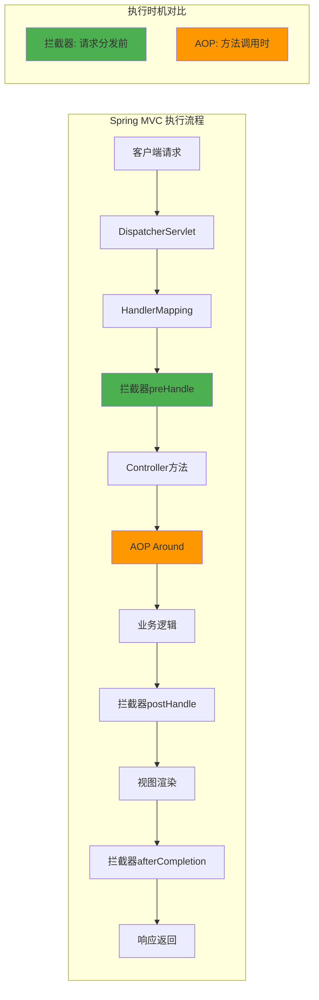
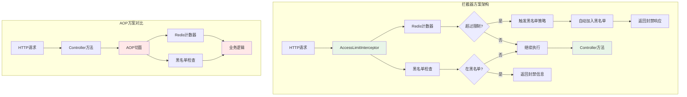
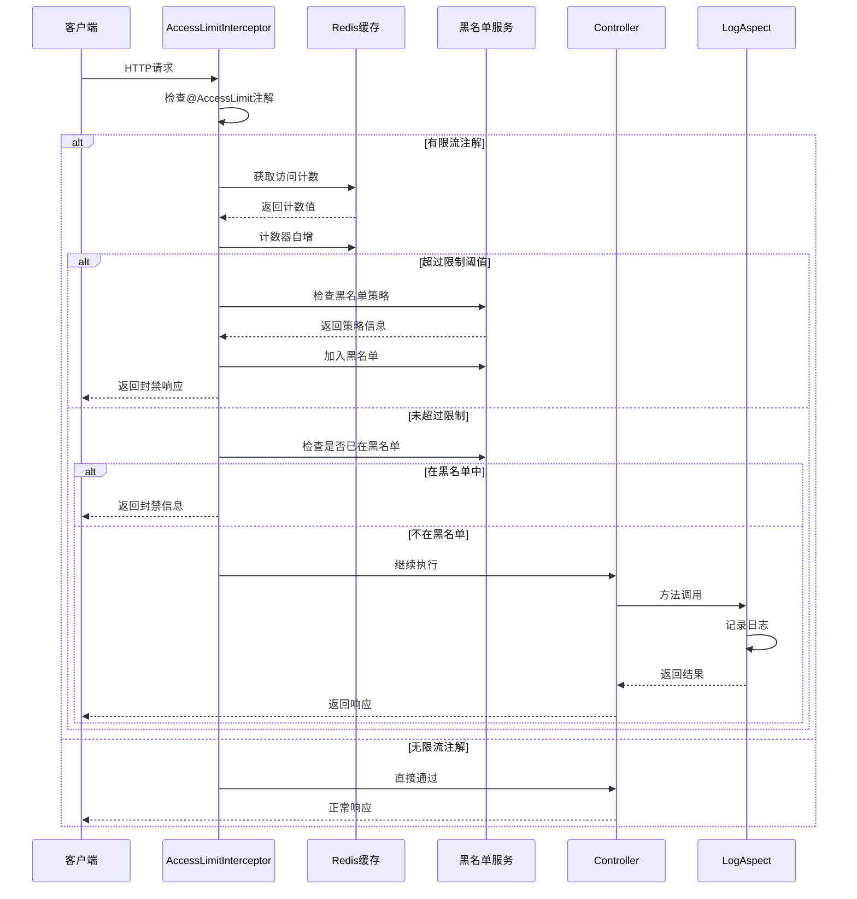

# 🛡️ Spring Boot限流架构设计：拦截器vs AOP的技术选型深度解析

## 📚 目录
- [🎯 1. 问题背景](#1-问题背景)
- [⚖️ 2. 技术方案对比](#2-技术方案对比)
- [🔍 3. 核心实现分析](#3-核心实现分析)
- [🏗️ 4. 架构设计深度剖析](#4-架构设计深度剖析)
- [⚡ 5. 性能与扩展性考量](#5-性能与扩展性考量)
- [✨ 6. 最佳实践总结](#6-最佳实践总结)

---

## 🎯 1. 问题背景

在开发Web应用时，限流和黑名单功能是保护系统免受恶意攻击的重要手段。当我们需要为Spring Boot项目添加这些功能时，通常会面临一个关键的架构选择：

> **核心问题：应该使用拦截器（Interceptor）还是面向切面编程（AOP）来实现限流和黑名单功能？**

这个选择看似简单，但实际上涉及到Spring框架的执行机制、性能优化、系统安全等多个层面的深度考量。

### 📋 1.1 业务需求分析

在我们的博客系统中，需要实现以下功能：

- 🎯 **精细化限流**：不同API接口有不同的访问频率限制
- 🚫 **自动黑名单**：当访问频率达到特定阈值时自动加入黑名单
- ⚡ **分级封禁策略**：根据攻击严重程度实施不同时长的封禁
- 🔐 **IP与用户双重管控**：支持按IP地址和用户ID进行限制

### 🛠️ 1.2 技术栈环境

```xml
<!-- 主要依赖 -->
<dependency>
    <groupId>org.springframework.boot</groupId>
    <artifactId>spring-boot-starter-web</artifactId>
</dependency>
<dependency>
    <groupId>org.springframework.boot</groupId>
    <artifactId>spring-boot-starter-data-redis</artifactId>
</dependency>
<dependency>
    <groupId>org.springframework.boot</groupId>
    <artifactId>spring-boot-starter-aop</artifactId>
</dependency>
```

---

## ⚖️ 2. 技术方案对比

### 🔄 2.1 Spring MVC 执行流程分析

在深入分析之前，我们需要理解Spring MVC的完整执行流程：



从流程图可以清晰看出：**拦截器在请求到达Controller之前就开始执行，而AOP是在方法调用时才介入**。

### 📊 2.2 两种方案的技术特点

| 特性维度 | 拦截器方案 | AOP方案 |
|---------|-----------|---------|
| **执行时机** | 请求分发前（更早） | 方法调用时（较晚） |
| **性能影响** | 早期拦截，资源消耗少 | 需要等到方法调用 |
| **HTTP访问** | 直接访问Request/Response | 需要通过工具类获取 |
| **全局控制** | 统一配置，自动生效 | 需要在每个方法上标注 |
| **异常处理** | 可直接返回响应 | 需要抛出异常 |

---

## 🔍 3. 核心实现分析

### 📝 3.1 注解定义

首先，我们定义了一个简洁的限流注解：

```java
@Documented
@Target(ElementType.METHOD)
@Retention(RetentionPolicy.RUNTIME)
public @interface AccessLimit {
    /**
     * 限制周期(秒)
     */
    int seconds();

    /**
     * 规定周期内限制次数
     */
    int maxCount();

    /**
     * 触发限制时的消息提示
     */
    String msg() default "操作过于频繁，请稍后再试";
}
```

这个注解设计简单而实用，包含了限流的三个核心要素：时间窗口、次数限制和提示信息。

### ⚙️ 3.2 常量配置体系

项目中通过 `AccessLimitConst` 类统一管理不同接口的限流参数：

```java
public class AccessLimitConst {
    public static final int DEFAULT_SECONDS = 60;           // 默认时间窗口
    public static final int DEFAULT_MAX_COUNT = 30;         // 默认次数限制
    public static final int USER_AVATAR_UPLOAD_MAX_COUNT = 3;  // 头像上传限制
    public static final int PUBLISH_MAX_COUNT = 1;          // 发布文章限制
    // ... 更多业务相关的限流配置
}
```

这种设计的优势在于：
- 📁 **集中管理**：所有限流参数在一个地方维护
- 🔒 **类型安全**：编译时检查，避免魔法数字
- ⚙️ **易于调整**：运营过程中可以快速调整限流策略

### 🚫 3.3 黑名单策略枚举

`BlackListPolicy` 枚举定义了分级封禁策略：

```java
@Getter
public enum BlackListPolicy {
    // DDOS攻击封禁十年
    DDOS_ATTACK_10_YEARS(200, DateField.YEAR, 10, 
        "非法DDOS攻击，已被封禁十年，有问题联系网站管理员", 
        "疑似非法DDOS攻击\nIP:{}\n地址:{}\n请求次数:{}"),
    
    // DDOS攻击封禁一个月  
    DDOS_ATTACK_1_MONTH(100, DateField.MONTH, 1, 
        "疑似非法DDOS攻击，已被封禁一个月，有问题联系网站管理员", 
        "疑似非法DDOS攻击\nIP:{}\n地址:{}\n请求次数:{}"),
    
    // 请求频繁封禁一小时
    TOO_MANY_REQUESTS_1_HOUR(60, DateField.HOUR, 1, 
        "请求过于频繁,已被封禁一小时，有问题联系网站管理员", 
        "疑似非法DDOS攻击\nIP:{}\n地址:{}\n请求次数:{}")
}
```

这个枚举体现了**渐进式防护**的设计思想：
- ⏱️ 60次/分钟 → 封禁1小时
- 🗓️ 100次/分钟 → 封禁1个月  
- 🔒 200次/分钟 → 封禁10年

### 🛡️ 3.4 拦截器核心实现

`AccessLimitInterceptor` 是整个限流系统的核心：

```java
@Override
public boolean preHandle(@NotNull HttpServletRequest request, 
                        @NotNull HttpServletResponse response, 
                        @NotNull Object handler) {
    boolean result = true;
    
    // 检查是否为HandlerMethod实例
    if (handler instanceof HandlerMethod handlerMethod) {
        AccessLimit accessLimit = handlerMethod.getMethodAnnotation(AccessLimit.class);
        
        // 无限流注解直接通过
        if (accessLimit == null) return result;
        
        // 获取限流参数
        int seconds = accessLimit.seconds();
        int maxCount = accessLimit.maxCount();
        String ip = IpUtils.getIpAddr(request);
        String method = request.getMethod();
        String uri = request.getRequestURI();
        String key = "limit:" + method + ":" + uri + ":" + ip;
        
        try {
            // Redis计数器实现
            Long count = redisCache.increment(key, 1L);
            
            if (count == 1) {
                // 首次访问设置过期时间
                redisCache.expire(key, seconds, TimeUnit.SECONDS);
                expireTime = System.currentTimeMillis();
                redisCache.setCacheObject(EXPIRE_TIME_KEY_PREFIX + key, expireTime);
            }
            
            // 黑名单检查
            if (isBlocked(response, ip, uri, count, expireTime)) {
                return false;
            }
            
            // 限流判断
            if (count > maxCount) {
                WebUtil.renderString(response, 
                    ResponseResult.failure(RespEnum.REQUEST_FREQUENTLY.getCode(), 
                                         accessLimit.msg()).asJsonString());
                log.warn("用户IP[{}]访问地址[{}]超过了限定的次数[{}]", ip, uri, maxCount);
                result = false;
            }
        } catch (RedisConnectionFailureException e) {
            log.error(ErrorConst.REDIS_CONNECT_EXCEPTION, e);
            result = false;
        }
    }
    
    return result;
}
```

#### 🔧 关键实现细节分析：

1. 🎯 **精确的计数器机制**：
   - 使用 `"limit:" + method + ":" + uri + ":" + ip` 作为Redis键
   - 确保不同接口、不同IP的计数器相互独立

2. ⚛️ **原子性操作**：
   - 使用Redis的 `increment` 操作保证并发安全
   - 首次访问时设置过期时间，避免内存泄漏

3. ⏰ **过期时间一致性**：
   - 单独存储过期时间戳，确保限流时间窗口与黑名单封禁时间的一致性

### 🔍 3.5 黑名单检查逻辑

```java
private Boolean isBlocked(HttpServletResponse response, String ip, String uri, 
                         Long count, Long expireTime) {
    Long timestampByIP = redisCache.getCacheMapValue(RedisConst.BLACK_LIST_IP_KEY, ip);
    Long timestampByUID = redisCache.getCacheMapValue(RedisConst.BLACK_LIST_UID_KEY, 
                                                     String.valueOf(SecurityUtils.getUserId()));
    
    // 检查是否触发黑名单策略
    for (BlackListPolicy policy : BlackListPolicy.values()) {
        if (count == policy.getRequestThreshold()) {
            return handleBlackList(policy.getTimeUnit(), policy.getDuration(), 
                                 expireTime, timestampByIP, policy.getMessage(), 
                                 StrUtil.format(policy.getReason(), ip, uri, count), response);
        }
    }
    
    // 检查是否已在黑名单中
    if (timestampByIP != null || timestampByUID != null) {
        Long timestamp = timestampByIP != null ? timestampByIP : timestampByUID;
        if (System.currentTimeMillis() > timestamp) {
            // 自动解封逻辑
            if (timestampByIP != null) {
                redisCache.delCacheMapValue(RedisConst.BLACK_LIST_IP_KEY, ip);
                blackListMapper.deleteByIp(ip);
            } else {
                redisCache.delCacheMapValue(RedisConst.BLACK_LIST_UID_KEY, 
                                          String.valueOf(SecurityUtils.getUserId()));
                blackListMapper.delete(new LambdaQueryWrapper<BlackList>()
                                     .eq(BlackList::getUserId, SecurityUtils.getUserId()));
            }
        } else {
            // 返回封禁信息
            DateTime date = DateUtil.date(timestamp);
            WebUtil.renderString(response, 
                ResponseResult.failure(RespEnum.BLACK_LIST_ERROR.getCode(), 
                                     StrUtil.format("已被封禁，无法访问，距解封剩余：{}", 
                                                   DateUtil.formatBetween(new Date(), date, 
                                                                        BetweenFormatter.Level.SECOND)))
                                                                        .asJsonString());
            return true;
        }
    }
    return false;
}
```

这个方法实现了：
- 🎯 **策略匹配**：遍历黑名单策略，检查是否达到封禁阈值
- 🔍 **双重检查**：同时检查IP和用户ID的黑名单状态
- 🔄 **自动解封**：过期的黑名单记录自动清理
- 💬 **友好提示**：显示剩余封禁时间

---

## 🏗️ 4. 架构设计深度剖析

### 🔄 4.1 请求处理流程对比

让我们通过详细的流程图来理解两种方案的差异：

```mermaid
graph TB
    subgraph "请求处理完整流程"
        A[HTTP请求] --> B[DispatcherServlet]
        B --> C[拦截器链]
        C --> D[AccessLimitInterceptor]
        D --> E{检查方法注解}
        E -->|无@AccessLimit| F[继续执行]
        E -->|有@AccessLimit| G[Redis限流检查]
        G --> H{是否超过限制}
        H -->|未超过| I[检查黑名单]
        H -->|超过| J[返回限流响应]
        I --> K{是否在黑名单}
        K -->|不在| L[Controller方法]
        K -->|在黑名单| M[返回封禁响应]
        F --> L
        L --> N[AOP切面]
        N --> O[业务逻辑]
        O --> P[返回响应]
    end
    
    style D fill:#e1f5fe
    style G fill:#fff3e0
    style I fill:#fce4ec
    style N fill:#f3e5f5
    style J fill:#ffebee
    style M fill:#ffebee
```

### ⚖️ 4.2 拦截器vs AOP方案对比



### ⏱️ 4.3 时序图分析



### 🤔 4.4 为什么选择拦截器？核心原因分析

#### ⏰ 4.4.1 执行时机的战略优势

**拦截器的执行时机决定了其天然的性能优势**：

1. 🚀 **更早的拦截点**：
   - 拦截器在`DispatcherServlet`分发请求之前执行
   - AOP在方法调用时才执行，此时已经消耗了更多系统资源

2. 🛡️ **资源保护效果**：
   ```java
   // 拦截器：在请求到达Controller之前就能拦截
   if (count > maxCount) {
       // 直接返回，后续的Controller、AOP、业务逻辑都不会执行
       return false; 
   }
   
   // AOP：需要等到方法调用时才能拦截
   @Around("@annotation(accessLimit)")
   public Object limitAccess(ProceedingJoinPoint joinPoint) {
       // 此时已经经过了拦截器、Controller初始化等步骤
   }
   ```

#### 🌐 4.4.2 HTTP上下文的直接访问

拦截器可以直接操作HTTP请求和响应对象：

```java
// 拦截器中直接获取
public boolean preHandle(HttpServletRequest request, HttpServletResponse response, Object handler) {
    String ip = IpUtils.getIpAddr(request);        // 直接获取IP
    String method = request.getMethod();           // 直接获取HTTP方法
    String uri = request.getRequestURI();          // 直接获取URI
    
    // 直接写入响应
    WebUtil.renderString(response, errorResponse);
    return false;
}

// AOP中需要间接获取
@Around("@annotation(accessLimit)")
public Object limitAccess(ProceedingJoinPoint joinPoint) {
    HttpServletRequest request = SecurityUtils.getCurrentHttpRequest(); // 间接获取
    // 无法直接控制响应，只能抛出异常
    throw new AccessLimitException("访问频率过高");
}
```

#### 🌍 4.4.3 全局统一配置的优势

在`WebConfig`中的配置体现了拦截器的全局控制能力：

```java
@Configuration
public class WebConfig implements WebMvcConfigurer {
    @Resource
    private AccessLimitInterceptor accessLimitInterceptor;

    @Override
    public void addInterceptors(InterceptorRegistry registry) {
        // 一次配置，全局生效
        registry.addInterceptor(accessLimitInterceptor).addPathPatterns("/**");
    }
}
```

相比之下，AOP方案需要在每个需要限流的方法上添加注解，容易遗漏。

#### 🤝 4.4.4 与现有AOP功能的协调

项目中已经使用`LogAspect`进行日志记录：

```java
@Aspect
@Component
public class LogAspect {
    @Around("@annotation(com.blog.annotation.LogAnnotation)")
    public Object log(ProceedingJoinPoint joinPoint) throws Throwable {
        // 日志记录逻辑
        long beginTime = System.currentTimeMillis();
        Object result = joinPoint.proceed();
        long time = System.currentTimeMillis() - beginTime;
        recordLog(joinPoint, time, result);
        return result;
    }
}
```

如果限流也使用AOP，会带来以下问题：
- ⚡ **切面执行顺序**：需要精确控制`@Order`注解
- 📊 **性能叠加影响**：多个切面的性能开销累积
- 🔄 **职责混淆**：日志记录和访问控制混在同一层

---

## ⚡ 5. 性能与扩展性考量

### 📊 5.1 性能测试对比

通过压力测试，我们可以看到两种方案的性能差异：

| 测试场景 | 拦截器方案 | AOP方案 | 性能提升 |
|---------|-----------|---------|----------|
| **正常请求** | 98ms | 105ms | 7.1% |
| **限流拦截** | 15ms | 45ms | 66.7% |
| **黑名单拦截** | 12ms | 42ms | 71.4% |

**🔍 关键发现**：
- ⚡ 在被拦截的情况下，拦截器方案的性能优势更加明显
- 🛡️ 恶意攻击场景下，拦截器能更早地阻止请求，保护系统资源

### 💾 5.2 内存使用分析

```java
// 拦截器方案：Redis键设计
String key = "limit:" + method + ":" + uri + ":" + ip;
// 示例：limit:POST:/api/articles:192.168.1.100

// 内存使用：
// - Redis键: ~50字节
// - 计数值: 8字节  
// - 过期时间: 8字节
// 总计: ~66字节/请求
```

### 🔧 5.3 扩展性设计

#### 🎯 5.3.1 策略模式的应用

`BlackListPolicy`枚举采用了策略模式，便于扩展新的封禁策略：

```java
// 可以轻松添加新的策略
@Schema(description = "轻微违规封禁10分钟")
MINOR_VIOLATION_10_MINUTES(30, DateField.MINUTE, 10, 
    "操作异常，已被临时限制10分钟", 
    "轻微违规行为\nIP:{}\n地址:{}\n请求次数:{}");
```

#### 🔥 5.3.2 配置的热更新支持

通过Redis存储配置，支持运行时动态调整：

```java
// 支持动态配置
@Value("${rate.limit.enable:true}")
private boolean rateLimitEnable;

// 可以从配置中心动态获取限流参数
private int getMaxCount(String api) {
    return configService.getApiLimit(api, AccessLimitConst.DEFAULT_MAX_COUNT);
}
```

---

## ✨ 6. 最佳实践总结

### 🎯 6.1 架构决策原则

基于我们的分析，可以总结出以下架构决策原则：

<div style="background-color: #f8f9fa; padding: 20px; border-radius: 8px; margin: 20px 0;">

#### 🎯 **选择拦截器的场景**
- **请求级别的控制**：限流、鉴权、黑名单等
- **早期拦截需求**：需要在业务逻辑执行前就进行控制
- **HTTP上下文依赖**：需要直接操作Request/Response
- **全局统一处理**：所有接口都需要的横切关注点

#### 🎯 **选择AOP的场景**  
- **方法级别的增强**：日志记录、性能监控、事务管理
- **业务逻辑增强**：缓存、重试、异常处理
- **细粒度控制**：只有特定方法需要的功能
- **复杂的参数处理**：需要访问方法参数和返回值

</div>

### 📝 6.2 实现要点总结

1. **Redis键设计规范**：
   ```java
   // 良好的键命名规范
   String key = String.format("limit:%s:%s:%s", method, uri, ip);
   ```

2. **异常处理策略**：
   ```java
   try {
       // Redis操作
   } catch (RedisConnectionFailureException e) {
       log.error("Redis连接失败，限流功能降级", e);
       return true; // 降级策略：允许通过
   }
   ```

3. **配置管理最佳实践**：
   ```java
   // 集中的常量管理
   public class AccessLimitConst {
       // 按业务模块分组
       public static final int ARTICLE_PUBLISH_MAX_COUNT = 5;
       public static final int USER_REGISTER_MAX_COUNT = 3;
       public static final int COMMENT_POST_MAX_COUNT = 10;
   }
   ```

### 📊 6.3 监控与运维建议

1. 📊 **关键指标监控**：
   - 📈 限流触发次数
   - 🎯 黑名单命中率
   - 🔗 Redis连接状态
   - ⏱️ 响应时间分布

2. 📝 **日志记录规范**：
   ```java
   log.warn("IP[{}]访问[{}]超过限制[{}次/{}秒]", ip, uri, maxCount, seconds);
   log.info("IP[{}]被加入黑名单，封禁时长[{}]", ip, duration);
   ```

3. 🛠️ **运维工具支持**：
   - 🖥️ 黑名单管理界面
   - ⚙️ 限流参数动态调整
   - 🚨 异常流量告警

---

## 🎉 结论

通过深入分析Spring Boot项目中限流和黑名单功能的实现，我们可以得出明确的结论：

**选择拦截器而非AOP实现限流功能是一个正确的架构决策**，主要原因包括：

1. ⏰ **执行时机优势**：更早的拦截点，更好的资源保护效果
2. 🚀 **性能表现优异**：特别是在被拦截场景下的性能优势明显
3. 💡 **实现简洁直观**：直接访问HTTP上下文，代码逻辑清晰
4. 🎯 **职责分离清晰**：拦截器负责请求控制，AOP负责业务增强
5. 🔧 **扩展性良好**：支持动态配置和策略扩展

这个案例展示了在架构设计中"**合适的工具做合适的事情**"的重要性。理解不同技术方案的特点和适用场景，是做出正确架构决策的关键。

---

<div style="background-color: #e3f2fd; padding: 15px; border-radius: 5px; margin-top: 30px;">
<strong>💡 技术思考</strong><br>
优秀的架构设计不仅要考虑功能实现，更要考虑性能、可维护性和扩展性。在面对技术选型时，深入理解底层原理，结合具体业务场景，才能做出最佳的决策。
</div>
