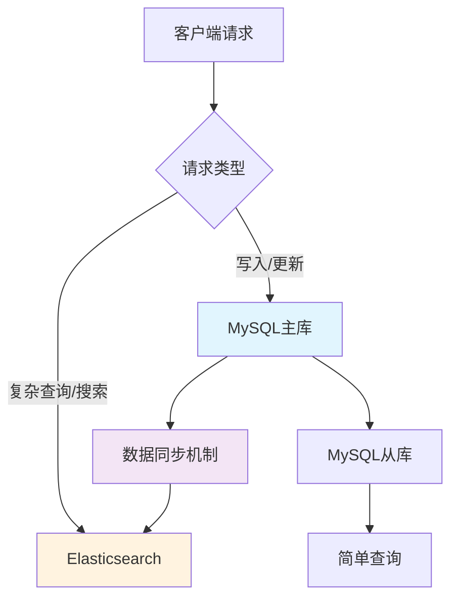
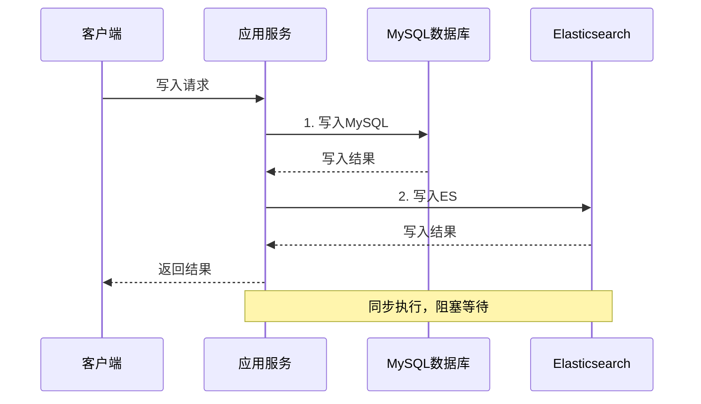
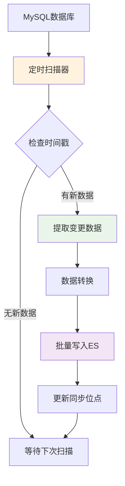
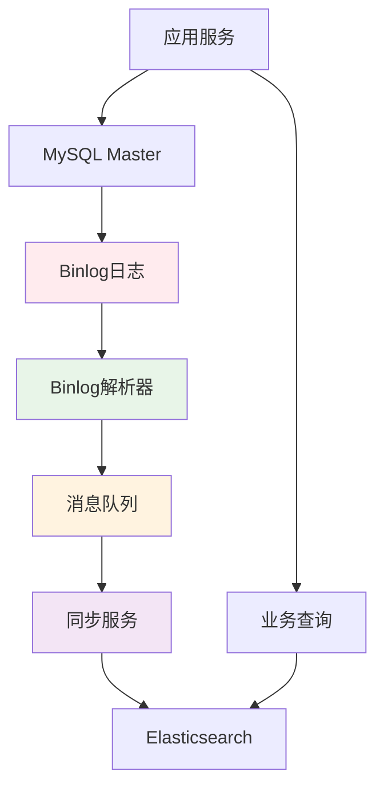
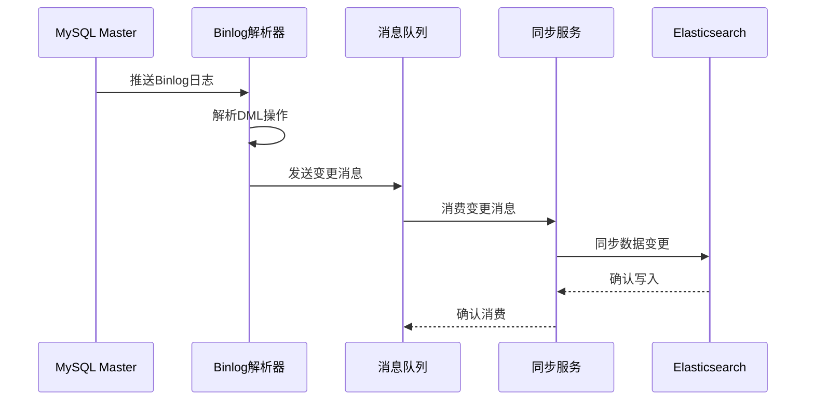
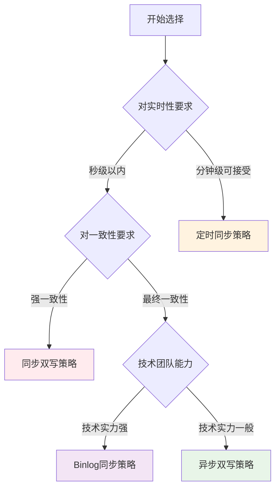
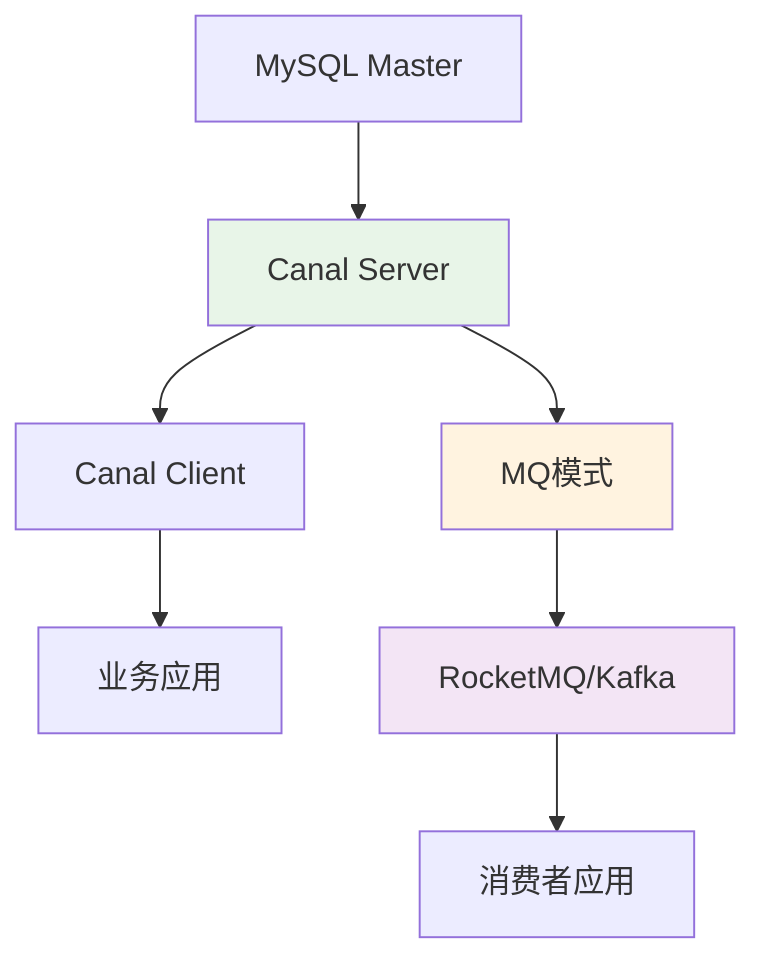
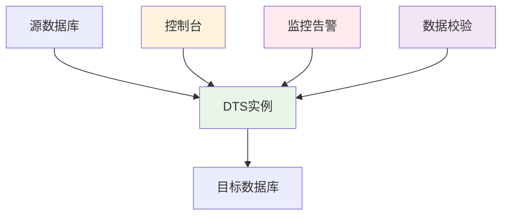
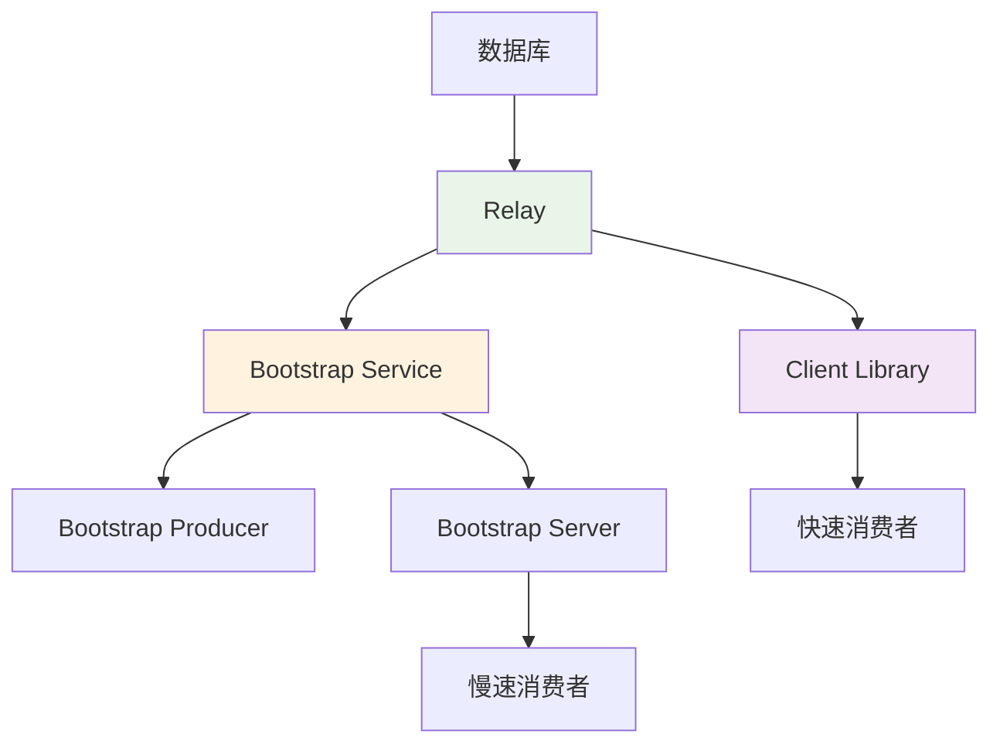

## 目录

- [1. 前言](#1-前言)
- [2. 数据同步方案对比](#2-数据同步方案对比)
  - [2.1 同步双写](#21-同步双写)
  - [2.2 异步双写](#22-异步双写)
  - [2.3 基于SQL抽取](#23-基于sql抽取)
  - [2.4 基于Binlog实时同步](#24-基于binlog实时同步)
- [3. 同步策略对比总结](#3-同步策略对比总结)
- [4. 主流同步工具介绍](#4-主流同步工具介绍)
---

## 1. 前言

在现代分布式系统架构中，**读写分离**已成为应对高并发、大数据量场景的标准解决方案。MySQL作为主要的业务数据库承担写入和核心查询任务，而Elasticsearch作为搜索引擎承担复杂查询和全文检索任务，这种架构能够：

<div align="center">



</div>

> **🎯 核心价值**
> - **性能提升**：缓解MySQL查询压力，提升系统整体性能
> - **功能互补**：MySQL保证ACID特性，ES提供强大的搜索能力
> - **扩展性**：支持海量数据的复杂查询和实时分析
> - **可用性**：降低单点故障风险，提高系统可用性

然而，**数据一致性**成为这种架构面临的核心挑战。如何确保MySQL和ES之间的数据同步，是系统设计的关键问题。

目前主流的数据同步策略主要有以下4种：
- **同步双写**：在业务代码中同时写入MySQL和ES
- **异步双写**：通过消息队列实现异步写入
- **定时同步**：定时扫描数据库变更并同步到ES
- **Binlog同步**：基于MySQL的Binlog日志实现实时同步

本文将详细分析这4种策略的优缺点，帮助大家根据实际业务场景选择最合适的方案。

---

## 2. 数据同步方案对比

### 2.1 同步双写

同步双写是最直观的数据同步方案，在业务代码中同时写入MySQL和ES。

<div align="center">



</div>

#### 实现示例

```java
@Service
public class ProductService {
    
    @Autowired
    private ProductMapper productMapper;
    
    @Autowired
    private ElasticsearchTemplate esTemplate;
    
    @Transactional
    public void saveProduct(Product product) {
        try {
            // 1. 写入MySQL
            productMapper.insert(product);
            
            // 2. 写入ES
            ProductDocument doc = convertToDocument(product);
            esTemplate.save(doc);
            
        } catch (Exception e) {
            // 任一操作失败都会回滚
            throw new RuntimeException("数据同步失败", e);
        }
    }
}
```

#### 优缺点分析

| 优点 ✅                               | 缺点 ❌                                     |
| ------------------------------------ | ------------------------------------------ |
| **实时性高**：数据写入后立即可查询   | **性能瓶颈**：双写操作增加响应时间         |
| **逻辑简单**：实现直观，易于理解     | **代码侵入**：业务代码与同步逻辑强耦合     |
| **强一致性**：通过事务保证数据一致性 | **可用性风险**：ES故障会影响MySQL写入      |
|                                      | **维护成本高**：每个写入点都需要添加ES操作 |

### 2.2 异步双写

通过消息队列实现异步的多数据源写入，解耦业务逻辑与数据同步。

<div align="center">


</div>

#### 实现示例

```java
@Service
public class ProductService {
    
    @Autowired
    private ProductMapper productMapper;
    
    @Autowired
    private RabbitTemplate rabbitTemplate;
    
    public void saveProduct(Product product) {
        // 1. 写入MySQL
        productMapper.insert(product);
        
        // 2. 发送MQ消息
        ProductSyncMessage message = new ProductSyncMessage();
        message.setOperation("INSERT");
        message.setProductId(product.getId());
        message.setData(product);
        
        rabbitTemplate.convertAndSend("product.sync.exchange", 
                                     "product.sync.key", 
                                     message);
    }
}

@RabbitListener(queues = "product.sync.queue")
@Component
public class ProductSyncConsumer {
    
    @Autowired
    private ElasticsearchTemplate esTemplate;
    
    public void handleProductSync(ProductSyncMessage message) {
        try {
            switch (message.getOperation()) {
                case "INSERT":
                case "UPDATE":
                    ProductDocument doc = convertToDocument(message.getData());
                    esTemplate.save(doc);
                    break;
                case "DELETE":
                    esTemplate.delete(ProductDocument.class, message.getProductId());
                    break;
            }
        } catch (Exception e) {
            // 重试机制或死信队列处理
            throw new RuntimeException("ES同步失败", e);
        }
    }
}
```

#### 优缺点分析

| 优点 ✅                               | 缺点 ❌                                                     |
| ------------------------------------ | ---------------------------------------------------------- |
| **高性能**：异步处理，不阻塞主流程   | **最终一致性**：用户可能获取到es种过时的数据，存在数据延迟 |
| **高可用**：ES故障不影响MySQL写入    | **系统复杂度**：引入MQ增加运维成本                         |
| **可扩展**：支持多个消费者并行处理   | **代码侵入**：仍需在业务代码中发送消息                     |
| **容错性强**：基于MQ的重试和死信机制 | **消息丢失风险**：需要考虑MQ的可靠性保证                   |

### 2.3 基于SQL抽取

通过定时任务扫描数据库变更，实现数据同步。这种方案对业务代码零侵入。

<div align="center">



</div>

#### 实现原理

1. **数据库表设计**：在相关表中增加 `updated_at` 字段，记录数据变更时间
2. **定时扫描**：定时器按固定周期扫描指定表的变更数据
3. **增量提取**：根据时间戳提取指定时间段内的变更数据
4. **批量同步**：将提取的数据批量写入ES

#### 实现示例

```java
@Component
@Slf4j
public class DataSyncScheduler {
    
    @Autowired
    private ProductMapper productMapper;
    
    @Autowired
    private ElasticsearchTemplate esTemplate;
    
    @Autowired
    private RedisTemplate<String, String> redisTemplate;
    
    private static final String SYNC_TIMESTAMP_KEY = "product:sync:timestamp";
    
    @Scheduled(fixedDelay = 30000) // 每30秒执行一次
    public void syncProductData() {
        try {
            // 1. 获取上次同步时间戳
            String lastSyncTime = redisTemplate.opsForValue().get(SYNC_TIMESTAMP_KEY);
            LocalDateTime fromTime = lastSyncTime != null ? 
                LocalDateTime.parse(lastSyncTime) : LocalDateTime.now().minusHours(1);
            
            LocalDateTime toTime = LocalDateTime.now();
            
            // 2. 查询变更数据
            List<Product> changedProducts = productMapper.selectByUpdateTime(fromTime, toTime);
            
            if (!changedProducts.isEmpty()) {
                // 3. 批量同步到ES
                List<ProductDocument> documents = changedProducts.stream()
                    .map(this::convertToDocument)
                    .collect(Collectors.toList());
                
                esTemplate.save(documents);
                
                log.info("同步产品数据 {} 条", documents.size());
            }
            
            // 4. 更新同步时间戳
            redisTemplate.opsForValue().set(SYNC_TIMESTAMP_KEY, toTime.toString());
            
        } catch (Exception e) {
            log.error("数据同步失败", e);
        }
    }
}
```

#### 优缺点分析

| 优点 ✅                           | 缺点 ❌                                 |
| -------------------------------- | -------------------------------------- |
| **零侵入**：不改变原有业务代码   | **时效性差**：存在固定的同步延迟       |
| **业务解耦**：不影响原有系统性能 | **数据库压力**：定时轮询增加DB负载     |
| **实现简单**：逻辑清晰，易于维护 | **数据完整性**：可能遗漏快速变更的数据 |
| **成本低**：无需引入额外中间件   | **扩展性差**：难以处理复杂的数据关联   |

> **💡 经典实现**：Logstash的JDBC Input插件就是基于这种原理，通过配置SQL语句定期查询数据库变更并同步到ES。

### 2.4 基于Binlog实时同步

利用MySQL的Binlog日志实现实时数据同步，这是目前最主流的解决方案。

<div align="center">



</div>

#### 实现原理

1. **Binlog订阅**：伪装成MySQL Slave节点，订阅Master的Binlog日志
2. **日志解析**：解析Binlog中的DML操作（INSERT、UPDATE、DELETE）
3. **消息转换**：将解析结果转换为标准化的数据变更消息
4. **异步消费**：通过MQ异步消费变更消息，同步到ES

#### 核心流程



#### 优缺点分析

| 优点 ✅                         | 缺点 ❌                                      |
| ------------------------------ | ------------------------------------------- |
| **零侵入**：无需修改业务代码   | **技术复杂度高**：需要深入理解Binlog机制    |
| **实时性强**：毫秒级数据同步   | **运维成本高**：需要维护解析和同步组件      |
| **高性能**：不影响业务系统性能 | **数据格式限制**：依赖于Binlog格式          |
| **完整性好**：捕获所有数据变更 | **版本兼容性**：MySQL版本升级可能影响兼容性 |

---


## 3. 同步策略对比总结

通过以上分析，我们可以从多个维度对比这4种同步策略：

### 3.1 核心特性对比

| 策略           | 实时性 | 一致性     | 性能影响 | 代码侵入 | 技术复杂度 | 运维成本 |
| -------------- | ------ | ---------- | -------- | -------- | ---------- | -------- |
| **同步双写**   | ⭐⭐⭐⭐⭐  | 强一致性   | 较大     | 高       | 低         | 低       |
| **异步双写**   | ⭐⭐⭐⭐   | 最终一致性 | 小       | 中等     | 中等       | 中等     |
| **定时同步**   | ⭐⭐     | 最终一致性 | 很小     | 无       | 低         | 低       |
| **Binlog同步** | ⭐⭐⭐⭐⭐  | 最终一致性 | 很小     | 无       | 高         | 高       |

### 3.2 适用场景分析

| 业务场景     | 推荐策略   | 选择理由                         |
| ------------ | ---------- | -------------------------------- |
| **小型项目** | 定时同步   | 实现简单，成本低，满足基本需求   |
| **电商搜索** | Binlog同步 | 实时性要求高，数据量大           |
| **内容管理** | 定时同步   | 对实时性要求不高，数据变更频率低 |
| **金融系统** | 同步双写   | 强一致性要求，数据准确性优先     |
| **社交平台** | 异步双写   | 高并发，允许短暂延迟             |
| **日志分析** | 异步双写   | 高吞吐量，对实时性要求不严格     |

### 3.3 技术选型决策树

<div align="center">



</div>

---

## 4. 主流同步工具介绍

对于Binlog同步策略，市面上有多种成熟的工具可以选择：

### 4.1 Canal

阿里巴巴开源的基于MySQL数据库增量日志解析工具，专门用于提供增量数据订阅和消费。

<div align="center">



</div>

#### 核心特性

- **高性能**：单机可支持数千个MySQL实例的订阅
- **高可用**：支持Canal Server的HA机制
- **多种模式**：支持TCP、MQ等多种数据投递方式
- **丰富的客户端**：提供Java、Go、Python等多语言客户端

#### 架构组件

| 组件              | 功能描述                           |
| ----------------- | ---------------------------------- |
| **Canal Server**  | 核心组件，负责Binlog解析和数据分发 |
| **Canal Admin**   | 管理控制台，提供可视化的配置和监控 |
| **Canal Client**  | 客户端SDK，用于接收和处理数据变更  |
| **Canal Adapter** | 适配器组件，支持同步到ES、HBase等  |


### 4.2 阿里云DTS

阿里云提供的企业级数据传输服务，支持多种数据源之间的实时同步。

#### 核心优势

- **多数据源支持**：支持MySQL、PostgreSQL、MongoDB等20+数据源
- **高性能**：全量迁移性能可达70MB/s，增量同步TPS可达20万
- **高可用**：99.95%的服务可用性保证
- **可视化管理**：提供完整的Web控制台

#### 架构特点

<div align="center">



</div>

#### 适用场景

- **企业级应用**：对稳定性和性能要求极高的场景
- **多云环境**：需要在不同云平台间同步数据
- **合规要求**：需要满足数据安全和合规性要求
- **运维简化**：希望减少自建同步系统的运维成本

### 4.3 Databus

LinkedIn开源的低延迟数据变更捕获系统，支持事务级别的数据一致性。

#### 核心特性

- **事务一致性**：保证源数据库的事务完整性
- **低延迟**：毫秒级的数据变更通知
- **无限回溯**：支持消费者的历史数据回放
- **多数据源**：支持Oracle、MySQL等多种数据库

#### 架构组件

<div align="center">



</div>

### 4.4 其他工具

#### Maxwell

- **轻量级**：单一JAR包，部署简单
- **JSON输出**：直接输出JSON格式的变更数据
- **Kafka集成**：原生支持Kafka输出

#### Debezium

- **Kafka Connect**：基于Kafka Connect框构建
- **多数据库支持**：支持MySQL、PostgreSQL、MongoDB等
- **云原生**：支持Kubernetes部署

#### 工具对比矩阵

| 工具         | 开源 | 性能  | 易用性 | 社区活跃度 | 企业支持 |
| ------------ | ---- | ----- | ------ | ---------- | -------- |
| **Canal**    | ✅    | ⭐⭐⭐⭐⭐ | ⭐⭐⭐⭐   | ⭐⭐⭐⭐⭐      | 阿里巴巴 |
| **DTS**      | ❌    | ⭐⭐⭐⭐⭐ | ⭐⭐⭐⭐⭐  | ⭐⭐⭐        | 阿里云   |
| **Databus**  | ✅    | ⭐⭐⭐⭐  | ⭐⭐⭐    | ⭐⭐⭐        | LinkedIn |
| **Maxwell**  | ✅    | ⭐⭐⭐   | ⭐⭐⭐⭐⭐  | ⭐⭐⭐        | Zendesk  |
| **Debezium** | ✅    | ⭐⭐⭐⭐  | ⭐⭐⭐    | ⭐⭐⭐⭐       | Red Hat  |

### 4.5 工具选择建议

根据不同的业务需求和技术能力，可以参考以下选择建议：

| 工具          | 适用场景   | 优势                | 劣势               |
| ------------- | ---------- | ------------------- | ------------------ |
| **Canal**     | 中大型项目 | 成熟稳定，社区活跃  | 需要一定运维能力   |
| **阿里云DTS** | 企业级应用 | 托管服务，稳定可靠  | 成本较高，厂商绑定 |
| **Maxwell**   | 快速原型   | 轻量级，部署简单    | 功能相对简单       |
| **Debezium**  | 云原生环境 | Kafka生态，扩展性好 | 学习成本较高       |

> **💡 关键建议**：没有完美的方案，只有最适合的方案。选择时要综合考虑实时性、一致性、性能、复杂度等多个维度，找到最符合业务需求的平衡点。
